# Final Bug Report — SRSMA JEE CBT Platform

**Date:** 13 September 2026
**Supersedes:** [`PreliminaryBugReports.md`](PreliminaryBugReports.md)
**Companion:** [`FinalEnhancements.md`](FinalEnhancements.md)
**Method:** Direct source audit of all 143 files under [src/](src/), plus [vercel.json](vercel.json), [next.config.mjs](next.config.mjs) and [src/app/globals.css](src/app/globals.css).
**Deployment target:** Vercel **Hobby** (12 Serverless Function cap, 4.5 MB request cap, 1 cron/day) + Supabase free tier.
**Primary client device:** **Android / iOS phone** — this is weighted into every severity rating below.

---

## 0. Verification Honesty Statement

`node_modules` is not installed in this working tree, so the four checks in the preliminary report's
"Static Verification Matrix" (`typecheck`, `test`, `lint`, `check-tokens`) **could not be re-run**:

```
$ npm run typecheck
'tsc' is not recognized as an internal or external command
```

Every finding below is therefore derived from reading the source, not from tool output. Where the
preliminary report asserted a test/lint result, this document marks it **unverified** rather than
repeating it as fact. Two findings (FBR-04, FBR-22) are specifically the kind of defect that
`tsc --noEmit` **passes cleanly**, which is why a green typecheck was not sufficient assurance.

---

## 1. Executive Summary

| | Preliminary | Final |
|---|:---:|:---:|
| Total findings | 18 | **30** |
| P0 — Blocker | 2 | **3** |
| P1 — High | 5 | **7** |
| P2 — Medium | 7 | **12** |
| P3 — Low | 4 | **8** |
| Newly discovered | — | **14** |
| Confirmed as reported | — | **12** |
| Confirmed but **re-rated** | — | **3** |
| **Misdiagnosed / root cause wrong** | — | **3** |

### The three headline changes from the preliminary report

1. **BUG-03 (iOS fullscreen lockout) is misdiagnosed.** No student is locked out, because the
   barrier **never renders at all** — its guard reads an undeclared identifier that silently
   resolves to the DOM global `window.status`. The real defect is that the platform's only
   anti-cheating control is dead code and has been shipping as dead code. See **FBR-04**.

2. **A complete question-bank + answer-key exfiltration path exists with zero credentials.**
   Phone login auto-provisions an account for *any* 7–15 digit number, and that account can
   immediately open every published test and read every answer key and worked solution from the
   result page. See **FBR-03**. This is the most serious finding in this audit and it is absent
   from the preliminary report.

3. **Abandoned attempts are swept once per day, not every 5 minutes.** [vercel.json:5](vercel.json#L5)
   schedules `0 0 * * *`. The "opportunistic sweep" that was meant to cover the gap is attached to
   an endpoint **no client ever calls**. On phones — where the browser tab is killed by the OS
   routinely — this means missing scorecards and a confusing hard lockout. See **FBR-06**.

---

## 2. Disposition of Every Preliminary Finding

| Prelim | Verdict | Final ID | Note |
|---|---|---|---|
| BUG-01 | ✅ Confirmed | FBR-01 | Reproduced exactly as described. |
| BUG-02 | ✅ Confirmed | FBR-02 | Reproduced; upstream cause is unscoped standalone inserts. |
| BUG-03 | ❌ **Misdiagnosed** | FBR-04 | Barrier is unreachable dead code. Impact is the opposite of what was claimed. |
| BUG-04 | ✅ Confirmed + extended | FBR-05 | Also missing on `PATCH /api/students/:id` and bulk-import. |
| BUG-05 | ✅ Confirmed | FBR-09 | |
| BUG-06 | ⚠️ Confirmed, **re-rated P1 → P2** | FBR-17 | The publish gate *does* check option images, so students never see raw placeholders. |
| BUG-07 | ⚠️ Confirmed, **re-rated P1 → P3** | FBR-28 | Light mode is fully styled; the real gap is only the missing toggle. |
| BUG-08 | ✅ Confirmed | FBR-15 | |
| BUG-09 | ✅ Confirmed | FBR-14 | Exploitability is lower than stated — see the note in FBR-14. |
| BUG-10 | ✅ Confirmed | FBR-13 | |
| BUG-11 | ⚠️ Confirmed, **re-rated P2 → P1** | FBR-07 | Silently costs students marks. That is not a medium-severity defect. |
| BUG-12 | ✅ Confirmed | FBR-18 | |
| BUG-13 | ✅ Confirmed | FBR-19 | |
| BUG-14 | ✅ Confirmed + extended | FBR-23 | Same stale copy also sits in the global footer on every student page. |
| BUG-15 | ✅ Confirmed | FBR-25 | |
| BUG-16 | ❓ Unverified | FBR-27 | Cannot run lint. |
| BUG-17 | ✅ Confirmed, **deprioritised** | FBR-26 | Phone-first cohort: keyboard shortcuts serve almost nobody. |
| BUG-18 | ❌ **Misdiagnosed** | FBR-24 | Not "tap sensitivity" — there is **no backdrop handler at all**. |

---

## 3. Severity Definitions

| Severity | Definition |
|---|---|
| **P0 — Blocker** | Unauthenticated data exposure, exam-data corruption, or an unhandled 500 on a daily-use path. |
| **P1 — High** | Silent loss of student marks, exam lockout, account cross-contamination, or a broken exam UI on the primary device (phone). |
| **P2 — Medium** | Race condition, cloud quota breach, state divergence between two subsystems, or measurable mobile-data/latency cost during a live exam. |
| **P3 — Low** | Stale copy, cosmetic inconsistency, ergonomics, technical debt. |

---

# P0 — Critical Blockers

## FBR-01: Positional-parameter index shift crashes the student batch filter
*(= BUG-01, confirmed)*

- **Location:** [src/server/api/students/index.ts:76-122](src/server/api/students/index.ts#L76-L122)
- **Class:** Unhandled SQL error → HTTP 500
- **Trigger:** `/teacher/students` → pick a Batch from the dropdown with the search box empty.

### Root cause

The count query above it uses the Drizzle builder correctly (lines 38-66), but the aggregate query
drops to `db.$client.query` with hand-rolled positional parameters:

```ts
// line 111
${batch ? (batch === 'General' ? `AND (p.batch IS NULL OR p.batch = 'General')` : `AND p.batch = $4`) : ''}
...
// lines 117-122
search && batch && batch !== 'General'
  ? [pageSize, offset, `%${search}%`, batch]
  : search
    ? [pageSize, offset, `%${search}%`]
    : batch && batch !== 'General'
      ? [pageSize, offset, batch]   // <-- 3 params, but SQL text references $4
      : [pageSize, offset],
```

The `$4` placeholder is emitted whenever `batch` is set, but the 4th array slot only exists when
`search` is *also* set. Batch-without-search sends 3 parameters for a statement that binds 4:

```
error: bind message supplies 3 parameters, but prepared statement "" requires 4
```

### Impact

Batch filtering is the primary cohort-management mechanism for faculty. It 500s on every use.
Note the count query succeeds, so the page renders a total and *then* an error banner — which reads
as a flaky server rather than a deterministic bug.

### Fix

Build the parameter list and the placeholder indices from the same source of truth:

```ts
const params: unknown[] = [pageSize, offset];
const clauses: string[] = [];

if (search) {
  params.push(`%${search}%`);
  const i = params.length;
  clauses.push(`AND (p.full_name ILIKE $${i} OR p.username ILIKE $${i} OR p.email ILIKE $${i} OR p.phone ILIKE $${i})`);
}
if (batch === 'General') {
  clauses.push(`AND (p.batch IS NULL OR p.batch = 'General')`);
} else if (batch) {
  params.push(batch);
  clauses.push(`AND p.batch = $${params.length}`);
}
if (status === 'active') clauses.push(`AND p.is_active = true`);
else if (status === 'inactive') clauses.push(`AND p.is_active = false`);
```

**Add a regression test** asserting `(placeholder count) === params.length` for all eight
combinations of `search × batch × status`. This class of bug is invisible to `tsc`.

---

## FBR-02: Standalone solution ingest overwrites solutions across unrelated subjects
*(= BUG-02, confirmed)*

- **Location:** [src/server/api/questions/ingest.ts:50-80](src/server/api/questions/ingest.ts#L50-L80)
- **Class:** Data corruption — wrong solutions served to students
- **Trigger:** `/teacher/questions/upload` → upload worked solutions with no `paperId`.

### Root cause

```ts
const condition = targetPaperId
  ? and(eq(questions.paperId, targetPaperId), eq(questions.sourceQno, sol.sourceQno))
  : and(isNull(questions.paperId), eq(questions.sourceQno, sol.sourceQno));

const existing = await db.select({...}).from(questions).where(condition);
for (const q of existing) {                       // <-- every match, every subject
  await db.update(questions).set(updates).where(eq(questions.id, q.id));
}
```

For paper-scoped questions, `(paper_id, source_qno)` is effectively unique — the index at
[schema.ts:117](src/db/schema.ts#L117) exists for exactly that. For standalone questions
`paper_id IS NULL`, so `source_qno = 1` matches **every question ever uploaded as question 1**,
across Physics, Chemistry and Maths, across every upload batch. The loop then overwrites all of
them with the current batch's solution — and `sourcePage` too.

Mode 1 of the same handler ([ingest.ts:87-118](src/server/api/questions/ingest.ts#L87-L118)) is the
upstream cause: it inserts `paperId: null` with no uniqueness key beyond a random `humanCode`, so
`(NULL, sourceQno)` is guaranteed to collide across batches by design.

### Impact

Uploading Chemistry solutions silently replaces the Physics solutions a teacher entered last month.
Students then read a Chemistry worked solution under a Physics question on the scorecard. There is
no audit trail on the overwritten rows — `question_revisions` is not written by this path.

### Fix

Two changes, both required:

1. **Refuse unscoped solution updates.** `humanCode` is already unique
   ([schema.ts:88](src/db/schema.ts#L88)) — make it the join key for standalone questions:

```ts
for (const sol of parsed.solutions) {
  const condition = targetPaperId
    ? and(eq(questions.paperId, targetPaperId), eq(questions.sourceQno, sol.sourceQno))
    : sol.humanCode
      ? eq(questions.humanCode, sol.humanCode)
      : null;

  if (!condition) {
    throw new HttpError(
      422,
      'ambiguous_solution_target',
      `Solution for Q${sol.sourceQno} needs a paperId or a humanCode — ` +
      `"question number" alone is not unique across standalone uploads.`,
    );
  }
  // ...
  if (existing.length > 1) {
    throw new HttpError(409, 'ambiguous_solution_target', `Q${sol.sourceQno} matches ${existing.length} questions.`);
  }
}
```

2. Extend `IngestSolutionsPayload` in [src/lib/zod/ingest.ts](src/lib/zod/ingest.ts) with an
   optional `humanCode`, and have the extraction prompt emit it.

Add a test: two standalone batches sharing `sourceQno: 1` in different subjects, then ingest
solutions for one — assert the other row is byte-identical afterwards.

---

## FBR-03: 🆕 Unauthenticated question-bank and answer-key exfiltration via open phone auto-provisioning

- **Locations:**
  [src/lib/auth.ts:105-140](src/lib/auth.ts#L105-L140) (provisioning) ·
  [src/server/api/auth/login.ts:26-53](src/server/api/auth/login.ts#L26-L53) (entry point) ·
  [src/app/student/views/StudentDashboardView.tsx:18-33](src/app/student/views/StudentDashboardView.tsx#L18-L33) (no cohort scoping) ·
  [src/server/api/attempts/result.ts:60-80](src/server/api/attempts/result.ts#L60-L80) (answer + solution disclosure)
- **Class:** Broken access control / intellectual-property exposure
- **Trigger:** Open `/login`, type any 10 digits, press submit.

### Root cause

`loginWithPhone` has no allowlist. When no profile matches, it **creates one**:

```ts
} else {
  // Auto-provision a new student account so students can begin immediately
  const fullName = `Student ${cleanDigits.slice(-4)}`;
  let username = `student_${cleanDigits}`;
  ...
  const [created] = await db.insert(profiles).values({
    role: 'student', fullName, username, email,
    phone: fullPhone, batch: 'General',
    isActive: true, canLogin: true,           // <-- immediately live
  }).returning();
  user = created;
}
```

Auto-provisioning is clearly **intentional** — the Board Readiness Challenge landing page advertises
*"Instant Student Login • No Password Needed"*
([boardChallenge/page.tsx:46](src/app/boardChallenge/page.tsx#L46)). The defect is that the account
it creates is **unscoped**, and three downstream layers assume any student is a legitimate student:

1. `StudentDashboardView` lists **every** `tests.isPublished = true` row. There is no
   batch/entitlement filter — `batch` is used for reporting only, never for authorisation.
2. `POST /api/tests/:id/attempts` gates on `isPublished`, `opensAt`, `closesAt` and `maxAttempts` —
   never on cohort membership.
3. `GET /api/attempts/:id/result` returns `answer` and `solution` for every question
   ([result.ts:60-80](src/server/api/attempts/result.ts#L60-L80)), gated only on
   `resultsPolicy === 'immediate'` — which is the schema **default**
   ([schema.ts:162](src/db/schema.ts#L162)).

### Exploit path (no credentials, ~90 seconds)

```
POST /api/auth/login {"phone":"5555555555"}   -> 200, session cookie for a brand-new student
GET  /student                                  -> every published JEE mock test, publicly listed
POST /api/tests/<id>/attempts                  -> 201, attempt created
POST /api/attempts/<id>/submit                 -> 200, graded instantly (0 marks, irrelevant)
GET  /api/attempts/<id>/result                 -> full body, options, ANSWER KEY and SOLUTION
                                                  for all 75 questions
```

Repeat with a new number for each test. The entire verified question bank — the institution's core
asset, hand-verified question by question — walks out the door, and every row is attributable to a
fake profile that pollutes `v_test_ranks`, batch averages and cohort percentiles.

### Impact

Complete loss of question-bank confidentiality, plus permanent contamination of every cohort
statistic. Because auto-provisioned rows are indistinguishable from real students in
`/teacher/students`, cleanup is manual and error-prone.

### Fix

Keep the frictionless landing-page funnel; separate *lead capture* from *exam entitlement*.

1. **Add a gate column** and default self-service accounts to un-entitled:

```sql
ALTER TABLE profiles ADD COLUMN IF NOT EXISTS is_provisional boolean NOT NULL DEFAULT false;
```

```ts
// src/lib/auth.ts — auto-provision branch
.values({ role: 'student', /* ... */ batch: 'Prospective', isProvisional: true })
```

2. **Scope the dashboard and attempt creation to an audience**, not to "published":

```sql
ALTER TABLE tests ADD COLUMN IF NOT EXISTS audience text NOT NULL DEFAULT 'enrolled';
-- 'enrolled' | 'public'
```

Only `audience = 'public'` tests (the 20-question Board Challenge diagnostic) are visible to
`is_provisional` accounts. Enforce it in **both** `StudentDashboardView` and
`POST /api/tests/:id/attempts` — a dashboard filter alone is not an authorisation control.

3. **Never disclose keys to a provisional account.** In `attempts/result.ts`, gate `answer` and
   `solution` on `!session.isProvisional`, and set the Board Challenge test to
   `resultsPolicy: 'on_release'` so the diagnostic returns a strengths report rather than a key.

4. **Exclude provisional rows from every cohort statistic** — `v_test_ranks`,
   [analytics/cohort.ts](src/server/api/analytics/cohort.ts) and
   [analytics/test-by-id.ts](src/server/api/analytics/test-by-id.ts) — and show them in
   `/teacher/students` under a distinct "Prospective leads" tab with a one-click
   *Convert to enrolled student* action.

5. Rate-limit provisioning per IP separately from per-phone login
   ([login.ts:37-38](src/server/api/auth/login.ts#L37-L38) currently allows 30 *new accounts* per IP
   per 5 minutes) — and note this cap is itself bypassable, see FBR-14.

---

# P1 — High Severity

## FBR-04: 🆕 The fullscreen integrity barrier is unreachable dead code — it reads `window.status`
*(replaces the incorrect diagnosis in BUG-03)*

- **Location:** [src/app/student/attempts/[id]/TestRunnerClient.tsx:1191](src/app/student/attempts/[id]/TestRunnerClient.tsx#L1191)
- **Class:** Security control silently disabled + latent iOS lockout
- **Trigger:** Every exam, on every device, since the barrier was added.

### Root cause

```tsx
{!isFullscreen && status === 'in_progress' && !submitModalOpen && (
```

**`status` is not declared anywhere in this component.** The props are
`attemptId, testTitle, deadlineAt, studentName, serverTime`
([TestRunnerClient.tsx:107-119](src/app/student/attempts/[id]/TestRunnerClient.tsx#L107-L119)) —
there is no `status` prop, state, or local. A grep over the whole file returns only a comment, two
`res.status` property reads, and this line:

```
125:   // Online / Offline & Sync status.
307:   if (res.status === 403 && ...
311:   if (res.status === 401) {
1191:  {!isFullscreen && status === 'in_progress' && !submitModalOpen && (
```

The bare identifier therefore resolves up the scope chain to the **DOM global `window.status`**, a
legacy `string` that is `''` unless assigned. `'' === 'in_progress'` is always `false`, so the `&&`
chain short-circuits and **the barrier has never rendered for any student on any platform.**

This typechecks cleanly because `lib.dom.d.ts` declares `status: string` on `Window`. It is
precisely the defect a green `tsc --noEmit` cannot catch — which is why it survived an audit
reporting "0 errors".

### Impact — in two directions

- **Now:** the platform's only anti-cheating control does not exist. Any claim that full screen is
  "enforced for academic integrity" is false. The student-facing copy inside the dead block
  (*"This examination must be taken in full screen mode"*) has never been shown to anyone.
- **On naive repair:** merely declaring `status` would activate a barrier that iOS
  Safari/Chrome/Edge **cannot dismiss**. WebKit does not implement `requestFullscreen` on generic
  elements, so `document.documentElement.requestFullscreen` is `undefined`, `toggleFullscreen` is a
  no-op, and `isFullscreen` stays `false` forever. On a phone-first platform that would be a total
  lockout. This part of BUG-03's analysis is correct — it just describes a state the code never
  reaches.

A related live defect sits at
[TestRunnerClient.tsx:397-398](src/app/student/attempts/[id]/TestRunnerClient.tsx#L397-L398):

```ts
if (!document.fullscreenElement && document.documentElement.requestFullscreen) {
  document.documentElement.requestFullscreen().catch(() => {});   // inside useEffect
}
```

Every browser rejects fullscreen outside a user gesture, so this throws a console error on every
exam load and does nothing. (The instructions page does it correctly, on click —
[TestInstructionClient.tsx:56-63](src/app/student/tests/[id]/TestInstructionClient.tsx#L56-L63).)

### Fix

Do **not** resurrect a blocking barrier on a phone-first platform. Delete the dead block and the
`useEffect` fullscreen attempt, and replace them with the honest, non-blocking integrity model
designed in [`FinalEnhancements.md` §3](FinalEnhancements.md) — capability-detected, dismissible,
and paired with the tab-focus telemetry that already exists server-side.

Add an ESLint rule so this cannot recur — the default config does not flag globals:

```js
// eslint.config.mjs
rules: { 'no-restricted-globals': ['error', 'status', 'name', 'length', 'event', 'closed'] }
```

That single rule would have caught this line at build time.

---

## FBR-05: Phone numbers are not unique — students can be issued another student's session
*(= BUG-04, confirmed and extended)*

- **Locations:**
  [schema.ts:53](src/db/schema.ts#L53) (no constraint) ·
  [auth.ts:88-95](src/lib/auth.ts#L88-L95) (`.limit(1)`, no order) ·
  [students/index.ts:157-171](src/server/api/students/index.ts#L157-L171) (POST) ·
  [students/by-id.ts:98](src/server/api/students/by-id.ts#L98) (**PATCH — missed by the preliminary report**) ·
  [bulk-import.ts:80-90](src/server/api/students/bulk-import.ts#L80-L90) (CSV)
- **Class:** Authentication cross-contamination
- **Trigger:** Two students share a family phone number — routine for siblings in Indian coaching cohorts.

### Root cause

`profiles.phone` is plain `text('phone')`. `username` and `email` both carry `.unique()`; `phone`,
the **actual login credential for every student**, does not.

Every write path validates username and email and ignores phone:

| Path | username | email | phone |
|---|:---:|:---:|:---:|
| `POST /api/students` | ✅ | ✅ | ❌ |
| `PATCH /api/students/:id` | ✅ | ✅ | ❌ |
| `POST /api/students/bulk-import` | ✅ (incl. intra-CSV, [student-csv.ts:109-166](src/lib/student-csv.ts#L109-L166)) | ✅ | ❌ |
| `loginWithPhone` auto-provision | ✅ | ✅ | ❌ |

Login then resolves the collision arbitrarily:

```ts
.where(sql`${profiles.phone} = ${fullPhone} OR ${profiles.phone} = ${cleanDigits} OR ...`)
.limit(1);     // no ORDER BY — Postgres returns whichever row the plan reaches first
```

With no `ORDER BY`, the winner can change between queries as the plan flips between seq-scan and
index-scan, so the *same* phone number can authenticate as *different* students on different days.

### Impact

Student A receives Student B's session cookie: sees B's dashboard, opens B's in-progress attempt,
answers on B's behalf, and reads B's scorecard, rank and percentile. Severe privacy breach and
direct corruption of assessment records. The 90-day session TTL
([session.ts:5](src/lib/session.ts#L5)) means a mis-issued session persists for three months.

### Fix

1. **Normalise at write time** so `+919876543210`, `919876543210` and `9876543210` cannot coexist.
   Store E.164 only; `normalizePhone` ([auth.ts:51-69](src/lib/auth.ts#L51-L69)) already produces it.
   The three-way `OR` in the lookup then collapses to a single equality.
2. **Constrain the column** (run the de-dup report first — this will fail on existing collisions):

```sql
-- 1. find collisions
SELECT phone, count(*), array_agg(username) FROM profiles
WHERE phone IS NOT NULL GROUP BY phone HAVING count(*) > 1;

-- 2. then enforce
CREATE UNIQUE INDEX CONCURRENTLY IF NOT EXISTS idx_profiles_phone_unique
  ON profiles (phone) WHERE phone IS NOT NULL;
```

3. **Validate in all four write paths**, returning `409 phone_taken` with the conflicting
   `fullName` so faculty can see who holds it.
4. **Never guess on a collision.** If more than one row matches, return `409 phone_ambiguous` and
   ask for the username — a wrong guess here is an account takeover. `isUniqueViolation` is already
   available in [src/lib/http.ts](src/lib/http.ts) for the insert race.

---

## FBR-06: 🆕 Abandoned attempts are graded once per day, and the fallback sweep is unreachable

- **Locations:**
  [vercel.json:5](vercel.json#L5) (`"schedule": "0 0 * * *"`) ·
  [attempts/by-id.ts:18](src/server/api/attempts/by-id.ts#L18) (sweep on a dead endpoint) ·
  [tests/attempts.ts:41-63](src/server/api/tests/attempts.ts#L41-L63) (lockout) ·
  [lib/sweep.ts:33-56](src/lib/sweep.ts#L33-L56)
- **Class:** Missing results + exam lockout + unbounded sweep cost
- **Trigger:** A phone browser discards the exam tab — an OS-routine event, not an edge case.

### Root cause — three independent gaps that line up

**(a) The cron is daily, not 5-minutely.** [lib/sweep.ts:12-14](src/lib/sweep.ts#L12-L14) documents
the design intent: *"LLD §7.1: Vercel Cron every 5 min auto-submits any in_progress attempt past
deadline."* The shipped schedule is `0 0 * * *` — **00:00 UTC, once a day** (05:30 IST). Vercel
Hobby permits at most one cron invocation per day, so this is not a typo but an unacknowledged
consequence of the plan, and the code comment is now misleading.

**(b) The opportunistic sweep is attached to an endpoint nothing calls.** `by-id.ts` runs
`await sweepExpiredAttempts(db).catch(() => {})` on `GET /api/attempts/:id`. A grep for client
callers finds none:

```
$ grep -rn "api/attempts" src --include=*.tsx
.../ResultReviewClient.tsx:85     /api/attempts/${attemptId}/result
.../TestRunnerClient.tsx:191      /api/attempts/${attemptId}/questions
.../TestRunnerClient.tsx:299      /api/attempts/${attemptId}/answers
.../TestRunnerClient.tsx:359,366  /api/attempts/${attemptId}/events
.../TestRunnerClient.tsx:382      /api/attempts/${attemptId}/answers   (beacon)
.../TestRunnerClient.tsx:596      /api/attempts/${attemptId}/submit
```

Every page reads attempts through **server components** (`StudentTestRunnerView`,
`StudentAttemptResultView`), which query Drizzle directly. The bare `GET /api/attempts/:id` is
dispatched by [router.ts:151-153](src/server/api/router.ts#L151-L153) but has **zero callers**, so
its sweep never fires in production. `attempts/result.ts` — the one endpoint a stranded student
would hit — does **not** sweep, and returns `400 attempt_in_progress` instead.

**(c) Restarting is blocked with a misleading error.** In `tests/attempts.ts`, an `in_progress`
attempt whose deadline has passed falls through the `activeAttempt` guard (line 43) into:

```ts
if (existingAttempts.length >= test.maxAttempts) {   // 1 >= 1
  throw new HttpError(403, 'max_attempts_exceeded',
    `You have already completed all ${test.maxAttempts} allowed attempt(s) for this test.`);
}
```

The student has completed **nothing**. The message is factually wrong and unactionable.

### Impact

With `maxAttempts: 1` (the default, [schema.ts:159](src/db/schema.ts#L159)) and the exam opened on
a phone:

- Attempt stuck `in_progress` for up to **24 hours**.
- Result page: `400 attempt_in_progress`. Instructions page: `403 max_attempts_exceeded`.
- `v_test_ranks` excludes the attempt, so every *other* student's rank and percentile is computed
  against an incomplete cohort — and silently shifts after the 05:30 IST sweep.
- Teacher analytics under-report participation until the next morning.

There is exactly one self-healing path: the dashboard shows an "In Progress" badge
([StudentDashboardView.tsx:120](src/app/student/views/StudentDashboardView.tsx#L120)); if the
student clicks through to the runner, `StudentTestRunnerView` renders `TestRunnerClient` with a past
`deadlineAt`, the countdown immediately hits zero, and `closeAttempt('auto')` grades it. That
recovery depends entirely on the student choosing to re-open a test they believe they already
finished.

### Secondary defect in the same code path

`sweepExpiredAttempts` is **global and unbounded** — it selects *every* expired attempt
platform-wide and grades them **sequentially** in one request:

```ts
for (const { id } of expired) {
  await gradeAndCloseAttempt(database, id, 'auto_submitted');   // serial
}
```

When a 100-candidate weekend test ends, the single daily cron invocation must grade 100 attempts
serially — each a multi-query read plus a transaction — inside `maxDuration = 60`
([route.ts:16](src/app/api/[[...slug]]/route.ts#L16)). It will hit
`FUNCTION_INVOCATION_TIMEOUT` partway through, and `.catch(() => {})` at the call site means the
partial failure is invisible. There is no cursor, so the next run is 24 hours away.

### Fix

1. **Move the tick off Vercel Cron.** `cron-job.org` (already the documented dependency in
   [PRODUCTION-SETUP-GUIDE.md](PRODUCTION-SETUP-GUIDE.md)) can call
   `/api/cron/sweep-expired?key=$CRON_SECRET` every 5 minutes at no cost and with **no new
   serverless function** — the route is already inside the unified router. Keep the daily
   `vercel.json` entry as a backstop and correct the comment in `sweep.ts`.
2. **Bound each invocation** and report truthfully:

```ts
export async function sweepExpiredAttempts(db?: Db, limit = 25): Promise<{ closed: number; backlog: boolean }> {
  const expired = await database.select({ id: attempts.id })
    .from(attempts)
    .where(and(eq(attempts.status, 'in_progress'), lt(attempts.deadlineAt, new Date())))
    .orderBy(asc(attempts.deadlineAt))
    .limit(limit + 1);
  const batch = expired.slice(0, limit);
  // ... grade batch, then:
  return { closed, backlog: expired.length > limit };
}
```

Return `backlog` in the cron response so a monitor can see a queue forming.

3. **Self-heal on the paths students actually use.** Add a *targeted* single-attempt sweep (not the
   global one) to `attempts/result.ts` and to `tests/attempts.ts` before the max-attempts check:

```ts
if (attempt.status === 'in_progress' && Date.now() > +new Date(attempt.deadlineAt)) {
  await gradeAndCloseAttempt(db, attempt.id, 'auto_submitted');
}
```

4. **Fix the lockout message.** Count only `submitted`/`auto_submitted` toward `maxAttempts` —
   mirroring `StudentDashboardView.tsx:47-49`, which already computes `completedCount` correctly.
   The API and the dashboard currently disagree on what "attempts used" means.

---

## FBR-07: Selecting an option without "Save & Next" is graded but shown as *Not Answered*
*(= BUG-11, confirmed; re-rated P2 → P1)*

- **Locations:**
  [TestRunnerClient.tsx:454-467](src/app/student/attempts/[id]/TestRunnerClient.tsx#L454-L467) ·
  [grading.ts:35-48](src/lib/grading.ts#L35-L48) ·
  [attempts.ts:180-192](src/lib/attempts.ts#L180-L192)
- **Class:** UI/grader divergence → **students lose marks they did not knowingly risk**
- **Trigger:** Tap option B on Q1 → tap Q5 in the palette without "Save & Next". Extremely common on a phone, where the palette is the fastest way to move.

### Root cause

`handleSelectOption` writes the response but not the state:

```ts
const handleSelectOption = (key: string) => {
  setQuestions((prev) => {
    const copy = [...prev];
    const q = copy[currentIndex];
    if (q) copy[currentIndex] = { ...q, response: { key } };   // state untouched
    return copy;
  });
  scheduleSync();
};
```

`scheduleSync()` then ships that response to the server 300 ms later via `buildAnswersPayload()`
([lines 272-283](src/app/student/attempts/[id]/TestRunnerClient.tsx#L272-L283)), which sends
`response` and `state` as independent fields. The grader keys off `response` alone:

```ts
// grading.ts:35
export function isGradeableResponse(type, response) {
  if (!response) return false;
  if (type === 'mcq') return typeof response.key === 'string' && response.key.trim() !== '';
  ...
}
```

`state` is never consulted. So the palette cell stays **red (Not Answered)**, the pre-submit summary
table counts it under **"Not Ans"**
([lines 1130-1140](src/app/student/attempts/[id]/TestRunnerClient.tsx#L1130-L1140)), and the grader
awards `marksWrong` — `−1` by default.

Worse, the divergence is **persisted**: `normalizeResponse`
([attempts.ts:180-192](src/lib/attempts.ts#L180-L192)) stores `{key: 'B'}` alongside
`state: 'seen_unanswered'`, so the contradiction survives a reload and is what the sweep grades.

### Impact

A student reviewing the summary modal sees "Physics — Not Answered: 3" and submits believing those
three carry 0 marks. They carry −3. Every UI surface the student can consult tells them the opposite
of what the grader will do, and the discrepancy is invisible until the scorecard — with no way to
reconstruct what happened. This directly contradicts the marking contract the instructions page
presents.

Re-rated to **P1**: "student silently loses marks" is not a medium-severity concern on an assessment
platform.

### Fix

Adopt NTA semantics — **selection is the save**. This also removes a real usability trap on phones,
where "Save & Next" is easy to miss:

```ts
const handleSelectOption = (key: string) => {
  setQuestions((prev) => {
    const copy = [...prev];
    const q = copy[currentIndex];
    if (q) {
      copy[currentIndex] = {
        ...q,
        response: { key },
        state: q.state === 'flagged_unanswered' || q.state === 'answered_flagged'
          ? 'answered_flagged'
          : 'answered',
      };
    }
    return copy;
  });
  scheduleSync();
};
```

Apply the identical transition in `handleSetIntegerValue`
([lines 479-509](src/app/student/attempts/[id]/TestRunnerClient.tsx#L479-L509)) once the draft
parses to a finite number — and back to `seen_unanswered` when it does not, so a half-typed `-`
never shows green.

**Then add the invariant as a server-side repair**, because the UI is not the only writer:

```ts
// src/lib/attempts.ts — saveAttemptAnswersBatch
// Repair rather than reject: a mid-exam 422 must never block a save.
const items2 = items.map((it) =>
  isGradeableResponse(typeOf(it.questionId), it.response) &&
  (it.state === 'seen_unanswered' || it.state === 'not_seen')
    ? { ...it, state: 'answered' as const }
    : it,
);
```

Add a grading test asserting `isGradeableResponse === true` implies
`state ∈ {answered, answered_flagged}`.

---

## FBR-08: 🆕 The exam runner is nested inside the app chrome — broken layout and a one-tap escape on phones

- **Locations:**
  [src/app/student/layout.tsx:10-16](src/app/student/layout.tsx#L10-L16) ·
  [src/components/AppShell.tsx:21-67](src/components/AppShell.tsx#L21-L67) ·
  [TestRunnerClient.tsx:707](src/app/student/attempts/[id]/TestRunnerClient.tsx#L707) ·
  [globals.css:55-67](src/app/globals.css#L55-L67)
- **Class:** Mobile layout defect + integrity hole
- **Trigger:** Open any exam on a phone. **This is the primary device for this cohort.**

### Root cause

`/student/[[...slug]]` — including `/student/attempts/[id]`, the exam runner — renders inside
`StudentLayout`, which wraps everything in `AppShell`. The runner sizes itself to

```tsx
h-[calc(100dvh-var(--app-header-h))]  ... overflow-hidden
```

but `--app-header-h` only accounts for `AppShell`'s header. Below `md`, that header grows a second
row (the scrollable nav strip, `AppShell.tsx:58-66`) and the token doubles:

```css
:root { --app-header-h: 3.5rem; }
@media (max-width: 767px) { :root { --app-header-h: 6rem; } }
```

The runner subtracts the 6 rem header but **not** the three other chrome elements it is nested in:

| Element | Mobile height |
|---|---|
| `AppShell` sticky header + nav strip | 96 px (subtracted ✅) |
| `<main class="px-4 py-6">` vertical padding | 48 px (**not** subtracted) |
| Runner pane | `100dvh − 96px` |
| `AppShell` footer | ~37 px (**not** subtracted) |
| **Document total** | **≈ 100dvh + 85 px** |

So the page is ~85 px taller than the viewport. The student gets an outer page scroll *and* an inner
`overflow-y-auto` question pane — the classic nested-scroll trap, where a swipe meant to scroll the
question body instead drags the whole page and the CBT header with the timer slides out of view. On
a 360×640 phone, after the 56 px CBT header, the subject tabs, and the bottom action bar (which
`flex-wrap`s onto **two rows** at that width, `TestRunnerClient.tsx:932`), the question body gets
roughly a third of the screen.

### The integrity half

While the barrier of FBR-04 purports to enforce fullscreen, the same screen renders, permanently
visible above the exam:

- **"My tests"** and **"Analytics"** nav links (`AppShell.tsx:38-44, 58-66`)
- a **Logout** button (`AppShell.tsx:53`)
- the SRSMA logo, linking to `/student`

One tap on "My tests" leaves a live, timed exam. There is no `beforeunload` protection on a
client-side Next.js route change — `handleBeforeUnload`
([lines 376-388](src/app/student/attempts/[id]/TestRunnerClient.tsx#L376-L388)) only fires on a real
document unload, so an in-app navigation discards the unsynced buffer with no warning.

### Impact

The exam is cramped and janky on the device nearly every student uses, and the "full screen for
academic integrity" claim sits next to a logout button. Both halves are visible to every candidate.

### Fix

1. **Take the runner out of the chrome.** Give it its own bare layout:

```
src/app/student/attempts/[id]/layout.tsx   ->  no AppShell; requireStudent() only
```

Keep it inside the existing `/student/[[...slug]]` dispatcher so the **serverless function count
does not change** — App Router layouts are not separate functions.

2. **Own the full viewport:** `h-[100dvh]`, no outer `main` padding, no footer, and
   `overscroll-behavior: none` on the scroll container to kill scroll-chaining and pull-to-refresh
   mid-exam.
3. **Guard in-app navigation** with a confirm-on-leave, so the two remaining exits (back gesture,
   link) both flush answers first.
4. Full mobile-first exam layout in [`FinalEnhancements.md` §4](FinalEnhancements.md).

---

## FBR-09: Bulk question deletion leaves orphaned media in `stored_files`
*(= BUG-05, confirmed)*

- **Locations:**
  [questions/bulk.ts:106-108](src/server/api/questions/bulk.ts#L106-L108) vs
  [questions/by-id.ts:92](src/server/api/questions/by-id.ts#L92) ·
  [storage.ts:157-169](src/lib/storage.ts#L157-L169)
- **Class:** Unbounded database growth against a hard 500 MB ceiling

### Root cause

Single delete purges binaries; bulk delete does not.

```ts
// by-id.ts:92 — correct
await deleteQuestionImageDir(id);

// bulk.ts:106-108 — rows go, blobs stay
if (deletable.length > 0) {
  await db.delete(questions).where(inArray(questions.id, deletable));
}
```

`question_images` rows vanish via `ON DELETE CASCADE` ([schema.ts:131](src/db/schema.ts#L131)), so
the `stored_files` entries lose their last referrer and become **unreachable** — no query can find
them again, because the only key linking them was the cascaded row.

### Impact

Compounded by FBR-25 (base64, +33%), a routine ingest-and-discard workflow is the fastest route to
exhausting Supabase's free 500 MB. The failure mode is a hard write error across the whole database,
potentially mid-exam.

### Fix

```ts
if (deletable.length > 0) {
  await db.delete(questions).where(inArray(questions.id, deletable));
  await Promise.allSettled(deletable.map((id) => deleteQuestionImageDir(id)));
}
```

`allSettled`, not `all` — one failed blob delete must not abort the rest or surface as a 500 after
the rows are already gone.

Because orphans from every prior bulk delete are **already in the database**, also ship a reaper
(`npm run gc:orphans`) and a one-line health count on the teacher dashboard:

```sql
DELETE FROM stored_files sf
WHERE sf.key LIKE 'images/%'
  AND NOT EXISTS (SELECT 1 FROM question_images qi WHERE qi.storage_path = sf.key);
```

---

## FBR-10: 🆕 Attempt deadlines ignore the test's own closing time

- **Location:** [tests/attempts.ts:100](src/server/api/tests/attempts.ts#L100)
- **Class:** Exam-window integrity
- **Trigger:** A student starts a timed test shortly before `closesAt`.

### Root cause

```ts
const deadlineAt = new Date(Date.now() + test.durationS * 1000);
```

`test.closesAt` is validated at **entry** (lines 27-31) and then discarded. A 180-minute paper
opened at 17:50 for a test closing at 18:00 gets a deadline of 20:50 — two hours fifty minutes past
the advertised window.

### Impact

The exam window becomes unenforceable, which is the point of having one. A student who starts one
minute before close gets the full duration; classmates who started on time are ranked against them
in the same `v_test_ranks` cohort. Meanwhile `StudentDashboardView.tsx:51` marks the test "Closed"
while the attempt is still live, so the platform simultaneously reports the test closed and the
timer running.

### Fix

```ts
const fullDuration = Date.now() + test.durationS * 1000;
const windowClose = test.closesAt ? +new Date(test.closesAt) : Infinity;
const deadlineAt = new Date(Math.min(fullDuration, windowClose));
```

Then surface the truncation *before* the student commits, on the instructions page:

> ⚠️ This test closes at 6:00 PM. You have **10 minutes** remaining, not the full 180.

And refuse a start that leaves an unusable slice (`< 60s`) with a clear
`403 insufficient_time_remaining` rather than handing out a 30-second exam.

---

# P2 — Medium Severity

## FBR-11: 🆕 Option shuffling reorders options but keeps their original letters

- **Locations:** [src/lib/dto.ts:36-49](src/lib/dto.ts#L36-L49) ·
  [tests/attempts.ts:86-94](src/server/api/tests/attempts.ts#L86-L94)
- **Trigger:** Any test with `shuffleOptions: true`.

`toStudentQuestion` permutes the array but never relabels `opt.key`, and the runner renders
`{opt.key}` straight into the option badge
([TestRunnerClient.tsx:884](src/app/student/attempts/[id]/TestRunnerClient.tsx#L884)). The student
sees:

```
(C) ...        <- first option
(A) ...
(D) ...
(B) ...
```

Grading is **correct** — `optionOrders` is only a presentation permutation and the grader compares
original keys ([grading.ts:96-104](src/lib/grading.ts#L96-L104)) — so this costs no marks. But no
real CBT presents non-sequential option letters, and in a phone's narrow single column the scrambled
badges read as a rendering fault. It also makes peer discussion ambiguous: "the answer is C" now
depends on whose shuffle.

**Fix:** relabel on the way out, keeping the original key for grading:

```ts
options = reordered.map((opt, i) => ({
  ...opt,
  key: String.fromCharCode(65 + i),   // displayed label: A, B, C, D
  originalKey: opt.key,               // what the client must submit
}));
```

The client then submits `originalKey`. Alternatively — and more simply — **shuffle question order
only** and leave `shuffleOptions` off, since question shuffling already defeats answer-sharing. Add
a `dto` test asserting displayed keys are always `A..D` in sequence.

## FBR-12: 🆕 `beforeunload` is the wrong save hook on mobile — the primary device

- **Location:** [TestRunnerClient.tsx:376-388, 405](src/app/student/attempts/[id]/TestRunnerClient.tsx#L376-L388)

The final flush relies on `beforeunload`. On **iOS Safari it does not fire at all**, and on Android
Chrome it is unreliable when the OS reclaims a backgrounded tab. Registering it also disqualifies
the page from the **back/forward cache**, so every in-app back gesture becomes a full reload.

`visibilitychange → hidden` (lines 353-365) does call `syncWithServer()`, which covers the common
case — but that is a `fetch` the browser may cancel as the page freezes, whereas `sendBeacon` is
explicitly guaranteed to survive teardown.

**Fix:** make `pagehide` the authoritative flush and keep `beforeunload` only for the desktop
confirm dialog:

```ts
const flushBeacon = () => {
  flushTimeSpent();
  navigator.sendBeacon(
    `/api/attempts/${attemptId}/answers`,
    new Blob([JSON.stringify(buildAnswersPayload())], { type: 'text/plain;charset=UTF-8' }),
  );
};
window.addEventListener('pagehide', flushBeacon);
document.addEventListener('visibilitychange', () => { if (document.hidden) flushBeacon(); });
```

The `POST` alias for beacons already exists
([answers.ts:96](src/server/api/attempts/answers.ts#L96)), so no server change is needed.

## FBR-13: Ephemeral `SESSION_SECRET` silently logs students out mid-exam
*(= BUG-10, confirmed)*

- **Location:** [session.ts:31-48](src/lib/session.ts#L31-L48)

If `SESSION_SECRET` is unset, `getKey()` falls through to a **per-container random secret**, because
`DATA_DIR` is read-only on Vercel and `ensureDataDirs()` swallows the failure by design
([paths.ts:19-27](src/lib/paths.ts#L19-L27)). A cookie signed on Lambda A fails `jwtVerify` on
Lambda B, `getSession()` returns `null` ([session.ts:88-97](src/lib/session.ts#L88-L97)), and the
student is bounced to `/login`.

Mid-exam this surfaces as *"Signed out — your answers are saved on this device"*
([TestRunnerClient.tsx:311-313](src/app/student/attempts/[id]/TestRunnerClient.tsx#L311-L313)) — a
message that is technically true and completely mystifying, because the student never signed out.
The zero-config fallback is right for local dev and actively harmful in production.

**Fix:** fail fast at module load, so a misconfigured deploy breaks at boot rather than mid-exam:

```ts
if (process.env.NODE_ENV === 'production' && (!fromEnv || fromEnv.length < 32)) {
  throw new Error(
    'CRITICAL: SESSION_SECRET must be set to >= 32 chars in production. ' +
    'Without it every serverless container signs cookies with a different key.',
  );
}
```

Also add the check to `scripts/check-tokens.mjs` (already wired into `prebuild`) so CI catches it,
and document it as **required** in [.env.production.example](.env.production.example).

## FBR-14: In-memory mutex and rate limiter give no cross-container guarantee
*(= BUG-09, confirmed — with a correction to the stated impact)*

- **Locations:** [db-lock.ts:22-33](src/lib/db-lock.ts#L22-L33) · [rate-limit.ts:17](src/lib/rate-limit.ts#L17)

Both are process-local (`let tail`, `const buckets = new Map()`), and both files say so in their own
doc comments. On Vercel, concurrent requests land on different microVMs.

**Correction to the preliminary report:** the *rate-limit* half is real — an attacker who triggers
scale-out gets a fresh `buckets` map per container, so the "8 attempts per phone per 5 min" cap at
[login.ts:36-38](src/server/api/auth/login.ts#L36-L38) is a soft speed bump, not a control. That is
what makes FBR-03's provisioning abuse cheap at volume.

The *`withDbLock`* half is **less severe than described**. Its documented purpose is protecting a
single in-process PGlite WASM instance, not distributed exam locking, and the critical sections it
guards are already idempotent by design:

- `gradeAndCloseAttempt` short-circuits on `totalMarks !== null` ([attempts.ts:44-53](src/lib/attempts.ts#L44-L53));
- `saveAttemptAnswersBatch` uses `greatest()` for counters ([attempts.ts:213-219](src/lib/attempts.ts#L213-L219));
- attempt-number allocation re-reads `max(attempt_no)` **inside** a transaction, backstopped by
  `UNIQUE (test_id, student_id, attempt_no)`
  ([tests/attempts.ts:112-148](src/server/api/tests/attempts.ts#L112-L148)), with
  `isUniqueViolation` mapped to a clean 409.

So the realistic worst case is duplicated work, not corrupted marks. Fix the rate limiter first.

**Fix — and the preliminary report's Upstash recommendation is the wrong call here.** Adding Upstash
means a new vendor, two more secrets and a network hop on the login path, to replace something
Postgres already does. Supabase is already a dependency:

```sql
CREATE TABLE IF NOT EXISTS rate_limits (
  key          text PRIMARY KEY,
  count        integer NOT NULL DEFAULT 0,
  window_start timestamptz NOT NULL DEFAULT now()
);
```

```ts
// one round-trip, atomic, no new service, no new serverless function
const [row] = await db.execute(sql`
  INSERT INTO rate_limits (key, count, window_start) VALUES (${key}, 1, now())
  ON CONFLICT (key) DO UPDATE SET
    count = CASE WHEN rate_limits.window_start < now() - ${windowMs}::int * interval '1 ms'
                 THEN 1 ELSE rate_limits.count + 1 END,
    window_start = CASE WHEN rate_limits.window_start < now() - ${windowMs}::int * interval '1 ms'
                        THEN now() ELSE rate_limits.window_start END
  RETURNING count, window_start`);
```

Keep the in-memory limiter as a free first-tier filter and consult Postgres only on the auth path.
Where genuine cross-container serialisation is ever needed, use
`pg_advisory_xact_lock(hashtext($1))` rather than a second cache.

## FBR-15: Vercel's 4.5 MB request cap silently drops large PDF uploads
*(= BUG-08, confirmed)*

- **Location:** [papers/index.ts:18](src/server/api/papers/index.ts#L18)

```ts
const MAX_UPLOAD_BYTES = 60 * 1024 * 1024; // 60MB
```

Vercel's gateway rejects the request at **4.5 MB** on every plan, before Next.js is reached — so the
server-side guard, the `application/pdf` sniff and the SHA-256 de-dup check never run. The client
shows a generic network error, because a gateway 413 carries no JSON body for `PapersView.tsx` to
read.

**Fix (immediate, zero infrastructure):** make the limit honest and check it **client-side** first,
so the teacher gets an actionable message instead of a dead request:

```ts
const MAX_UPLOAD_BYTES = Number(process.env.MAX_UPLOAD_BYTES ?? 4 * 1024 * 1024);
```

```ts
// PapersView.tsx, before fetch
if (file.size > 4 * 1024 * 1024) {
  setError(`This PDF is ${(file.size / 1048576).toFixed(1)} MB. The upload limit is 4 MB — ` +
           `split the paper or compress it first.`);
  return;
}
```

The pre-signed direct-to-Supabase-Storage upload is the proper fix and is specified in
[`FinalEnhancements.md` §6.1](FinalEnhancements.md). Ship the honest limit now regardless — the
current state makes a hard platform limit look like an intermittent network fault.

## FBR-16: 🆕 `attempt_events` is write-only, undisclosed, and half-unused

- **Locations:** [attempts/events.ts:16-24, 67-71](src/server/api/attempts/events.ts#L16-L24) ·
  [router.ts:186](src/server/api/router.ts#L186) ·
  [TestRunnerClient.tsx:353-372](src/app/student/attempts/[id]/TestRunnerClient.tsx#L353-L372)

The integrity-telemetry pipeline is **half-built**. This is the direct precondition for the
proctoring work specified in `FinalEnhancements.md`.

**(a) Nothing reads it.** A repo-wide grep for `attemptEvents` outside the schema returns only the
`import` and the `insert` in `events.ts`. The module exports `POST` only, so `router.ts:186` can
never serve a `GET` — `dispatchApiRequest` answers `405 Method Not Allowed`. Every `tab_hidden` row
ever written is unreadable through the product.

**(b) Five of the seven event types are never emitted.** `KNOWN_EVENT_TYPES` declares
`tab_hidden`, `tab_visible`, `fullscreen_enter`, `fullscreen_exit`, `offline`, `online`,
`paste_blocked`. The client emits only the first two. `fullscreen_enter`/`exit` are the natural
partner to the dead barrier of FBR-04; `offline`/`online` have live handlers
(`handleOnline`/`handleOffline`, lines 344-351) that update local state and log nothing; there is no
paste handler at all.

**(c) Students are not told.** The instructions page
([TestInstructionClient.tsx:130-280](src/app/student/tests/[id]/TestInstructionClient.tsx#L130-L280))
has five sections — Timer, Palette, Marking Scheme, Navigating, Connection — and **none discloses
that focus changes are recorded**. Collecting behavioural telemetry from minors without disclosure
is the wrong default on consent grounds, and it also makes the data unusable: telemetry nobody was
warned about cannot fairly be acted on.

**(d) The mobile signal is noisy by nature.** On a phone, `visibilitychange → hidden` fires for an
incoming call, a notification pull-down, a screen lock, or any app switch. Raw counts will flag
honest students. Any surfacing of this data must classify by duration, not just count — designed in
[`FinalEnhancements.md` §3](FinalEnhancements.md).

**Fix:** add `GET` to `events.ts` (teacher-only; **zero new serverless functions**, the router
already dispatches the path), emit the remaining event types, aggregate per attempt in the teacher
scorecard, and add the disclosure section to the instructions. Full design in
[`FinalEnhancements.md` §3](FinalEnhancements.md).

## FBR-17: `unresolvedImages` filter misses option diagrams and partially-cropped questions
*(= BUG-06, confirmed; re-rated P1 → P2)*

- **Location:** [questions/index.ts:58-62](src/server/api/questions/index.ts#L58-L62)

```ts
conditions.push(sql`${questions.body} LIKE '%[[IMG:%' AND NOT EXISTS (
  SELECT 1 FROM question_images qi WHERE qi.question_id = ${questions.id}
)`);
```

Two flaws, both as reported: it scans `body` only (ignoring `options`, where JEE circuit and graph
options live), and `NOT EXISTS` is all-or-nothing — a question with two placeholders and one crop
done is **excluded** from the "needs work" list.

**Why P2, not P1.** The preliminary report's stated impact — students meeting raw `[[IMG:...]]` text
in a live exam — **cannot happen**, because two later gates do the check correctly:

- `POST /api/questions/bulk` (`verify`) calls `extractAllImageTokens(q.body, optionBodies)` and
  compares against the full `question_images` set
  ([bulk.ts:166-178](src/server/api/questions/bulk.ts#L166-L178));
- `POST /api/tests/:id/publish` refuses any test containing a non-`verified` question
  ([publish.ts:32-49](src/server/api/tests/publish.ts#L32-L49)), and
  `PUT /api/tests/:id/questions` blocks adding one to an already-published test
  ([tests/questions.ts:105-118](src/server/api/tests/questions.ts#L105-L118)).

So the real impact is wasted faculty time and a confusing workflow: the filter reports "0
unresolved", then bulk-verify rejects the same questions with `Unresolved image figures: ...`. Two
subsystems answer the same question differently.

**Fix:** reuse the logic that is already right. `extractAllImageTokens` is the source of truth — add
a maintained column so the filter and the gate cannot drift again:

```sql
ALTER TABLE questions ADD COLUMN IF NOT EXISTS image_token_count integer NOT NULL DEFAULT 0;
-- maintained on write from extractAllImageTokens(body, options)
```

```ts
if (unresolvedImages === 'true') {
  conditions.push(sql`${questions.imageTokenCount} > (
    SELECT count(*) FROM question_images qi WHERE qi.question_id = ${questions.id}
  )`);
}
```

## FBR-18: Test cloning is not transactional
*(= BUG-12, confirmed)*

- **Location:** [tests/clone.ts:29-58](src/server/api/tests/clone.ts#L29-L58)

The `tests` insert and the `testQuestions` insert are separate statements. If the second fails
(pooler timeout, or a `questionId` deleted between the read at line 23 and the write at line 47), a
ghost `"<Title> (Copy)"` draft with zero questions remains. It cannot be published
(`publish_gate_failed`, `publish.ts:30`) and there is no delete affordance for a broken clone, so it
accumulates in the teacher's list.

**Fix:** one transaction. `db.transaction` is already used correctly elsewhere
([tests/attempts.ts:113](src/server/api/tests/attempts.ts#L113),
[attempts.ts:125](src/lib/attempts.ts#L125)):

```ts
const clonedTest = await db.transaction(async (tx) => {
  const [t] = await tx.insert(tests).values({ /* ... */ }).returning();
  if (assigned.length > 0) {
    await tx.insert(testQuestions).values(assigned.map((q) => ({ ...q, testId: t.id })));
  }
  return t;
});
```

## FBR-19: The login page fires a full analytics aggregation to ask "am I signed in?"
*(= BUG-13, confirmed)*

- **Locations:** [LoginForm.tsx:47-53](src/app/login/LoginForm.tsx#L47-L53) ·
  [analytics/student-me.ts](src/server/api/analytics/student-me.ts) (160 lines of aggregation)

```ts
useEffect(() => {
  fetch('/api/analytics/student/me')
    .then((res) => { if (res.ok) router.replace('/student'); })
    .catch(() => {});
}, [router]);
```

Every visitor to `/login` — including the entire Board Readiness Challenge funnel, which lands there
from the landing-page CTA — triggers percentile, chapter-accuracy and rank-progression computation
just to test cookie presence. On a cold Supabase pooler connection from a phone on 4G this is the
slowest thing on the page, and the result is discarded.

**Fix:** add `GET /api/auth/me` reading `getSession()` only — **no new serverless function**, one
`if` in `router.ts`:

```ts
// router.ts, len === 2
if (s0 === 'auth' && s1 === 'me') return { handler: authMe, params: {}, pattern: '/api/auth/me' };
```

```ts
// src/server/api/auth/me.ts
export const GET = withApi(async () => {
  const session = await getSession();          // JWT verify only, zero DB queries
  return session
    ? json({ authenticated: true, userId: session.userId, role: session.role, fullName: session.fullName })
    : json({ authenticated: false });
});
```

Deliberately `getSession()` rather than `apiSession()` — see FBR-21.

## FBR-20: 🆕 Question diagrams are served `no-cache`, re-validating on every revisit

- **Location:** [files/image.ts:43, 53](src/server/api/files/image.ts#L43)

```ts
'Cache-Control': 'no-cache, private, must-revalidate',
```

Diagram bytes are **immutable for the life of a `(questionId, placeholderId)` pair** — the key is
derived from both ([paths.ts:52-54](src/lib/paths.ts#L52-L54)) and a re-crop writes a new
`storagePath`. `no-cache` forces a conditional request on every single view.

In a 75-question paper, a student navigating the palette re-requests each diagram every time the
question scrolls back into view. Each request costs a full auth round-trip (FBR-21), a
`question_images` lookup, an entitlement join, and a `stored_files` read with base64 decode — four
queries to answer *"still 304?"*. On a phone on patchy 4G, a stalled revalidation means a **blank
box where a circuit diagram should be**, mid-exam.

**Fix:** the ETag machinery is already in place (lines 39-49); let the browser trust it.

```ts
'Cache-Control': 'private, max-age=31536000, immutable',
```

`private` keeps it out of shared caches, so the entitlement check still gates first access. If
re-cropping must invalidate instantly, put the content hash in the URL
(`/api/files/images/:qid/:placeholder?v=<sha256>`) and keep `immutable`.

## FBR-21: 🆕 Every API call costs a database round-trip for authentication

- **Location:** [auth.ts:246-272](src/lib/auth.ts#L246-L272) (`apiSession`), called by
  `apiStudent`/`apiTeacher` on essentially every handler

`getSession()` already verifies a signed JWT carrying `userId`, `username`, `fullName` and `role`
([session.ts:82-99](src/lib/session.ts#L82-L99)) — cryptographically trustworthy with zero I/O.
`apiSession()` then re-reads the row anyway to confirm `isActive`/`canLogin`.

That is a correct and deliberate revocation check. The cost is that it runs on **every** request,
including the ones that fire constantly during an exam:

| During one 3-hour exam, per student | Count | Auth queries |
|---|---|---|
| Heartbeat `PATCH /answers` (15 s, [lines 331-336](src/app/student/attempts/[id]/TestRunnerClient.tsx#L331-L336)) | 720 | 720 |
| `POST /events` on focus change | ~10-50 | ~10-50 |
| `GET /files/images/...` (uncached, FBR-20) | 100+ | 100+ |

At 100 concurrent candidates that is **~4,800 auth queries per minute** from heartbeats alone,
against a Supabase free-tier pooler. Combined with FBR-06's global sweep, this is the realistic
scaling ceiling for a weekend mock test — and it will present as random 500s, not as a clean
capacity error.

**Fix:** tier the guard by what the endpoint actually risks.

1. Add `apiSessionFast()` — JWT-only, no DB — for high-frequency, low-risk, self-scoped writes
   (`/answers`, `/events`). Both already re-verify ownership against
   `attempt.studentId !== session.userId`
   ([answers.ts:38](src/server/api/attempts/answers.ts#L38),
   [events.ts:38](src/server/api/attempts/events.ts#L38)), so a JWT suffices: a deactivated student
   can at worst keep writing to their own in-progress attempt for the remaining token life.
2. Keep the full DB-backed `apiSession()` on login, teacher mutations, result disclosure and
   anything cross-user.
3. Shorten the 90-day session TTL ([session.ts:5](src/lib/session.ts#L5)) with refresh-on-use, so
   the JWT-only path has a bounded revocation window.

## FBR-22: 🆕 Analytics count `response IS NOT NULL` as "attempted"; the grader does not

- **Locations:**
  [analytics/cohort.ts:39, 43](src/server/api/analytics/cohort.ts#L39) ·
  [analytics/test-by-id.ts:162, 238-239](src/server/api/analytics/test-by-id.ts#L162) ·
  [analytics/test-export-questions.ts:92-93](src/server/api/analytics/test-export-questions.ts#L92-L93) ·
  vs [grading.ts:35-48](src/lib/grading.ts#L35-L48)

`isGradeableResponse` exists precisely because "non-null response" and "gradeable answer" had
already diverged once — its doc comment records the history:

> *"The result screen used to decide 'attempted' with a bare `response !== null`, while the grader
> required a non-blank key or a numeric value… Both now call this."*

Both **client-facing** paths now call it. The **analytics SQL does not** — five separate queries
still test `aa.response IS NOT NULL` in raw SQL, where the shared TypeScript helper is unreachable.

A row can be non-null yet ungradeable: `normalizeResponse`
([attempts.ts:180-192](src/lib/attempts.ts#L180-L192)) preserves `{value: "abc"}` when the string
does not parse, and legacy rows predate the numeric input guard at
[TestRunnerClient.tsx:488](src/app/student/attempts/[id]/TestRunnerClient.tsx#L488). Such a row
counts toward `times_attempted` and the accuracy denominator but grades as unattempted — so a
question's difficulty index is understated, and the same fact is reported differently on the
scorecard and in the teacher's CSV export.

**Fix:** push the predicate into SQL once, as an immutable function, so there is a single definition:

```sql
CREATE OR REPLACE FUNCTION is_gradeable(qtype qtype_enum, resp jsonb) RETURNS boolean AS $$
  SELECT CASE
    WHEN resp IS NULL THEN false
    WHEN qtype = 'mcq' THEN coalesce(btrim(resp->>'key'), '') <> ''
    ELSE (resp->>'value') ~ '^-?\d+\.?\d*$'
  END;
$$ LANGUAGE sql IMMUTABLE;
```

Replace all five `aa.response IS NOT NULL` sites with `is_gradeable(q.type, aa.response)`, and add a
test that grades a fixture attempt and asserts the analytics `times_attempted` equals the grader's
`isAttempted` count.

---

# P3 — Low Severity & Polish

## FBR-23: "Stored locally on this machine" copy ships to production — in three places
*(= BUG-14, confirmed and extended)*

- [TeacherOverviewView.tsx:29](src/app/teacher/views/TeacherOverviewView.tsx#L29) —
  `"Everything here is stored locally on this machine."`
- [AppShell.tsx:69](src/components/AppShell.tsx#L69) — **missed by the preliminary report** —
  `"{BRAND.orgName} · local build · all data stored on this machine"`, rendered in the global footer
  on **every student and teacher page**, including during an exam.
- [layout.tsx:20](src/app/layout.tsx#L20) — the `<meta name="description">` also ends `"Local build."`,
  so this leaks into search results and link previews for the landing page.

All three are PGlite-prototype leftovers. Teachers reasonably conclude their question bank is
machine-local and will vanish if they switch computers; students see "local build" on a live
assessment.

**Fix:** drive the copy from the active driver so it cannot go stale again:

```ts
// src/config/branding.ts
export const STORAGE_NOTE = process.env.DATABASE_URL
  ? 'Cloud database connected · SRSMA Central Examination System'
  : 'Local build · data stored on this machine';
```

## FBR-24: The mobile palette drawer has no backdrop dismissal at all
*(= BUG-18, misdiagnosed — not a sensitivity issue)*

- **Location:** [TestRunnerClient.tsx:1067-1069](src/app/student/attempts/[id]/TestRunnerClient.tsx#L1067-L1069)

```tsx
{mobilePaletteOpen && (
  <div className="fixed inset-0 z-50 flex flex-col justify-end bg-black/60 sm:hidden">
    <div className="max-h-[80vh] rounded-t-2xl bg-white p-4 ...">
```

The backdrop has **no `onClick`**, no `onPointerDown`, and no `Escape` handler. This is not
intermittent tap capture — outside taps have never done anything. The only exit is the `X` button at
line 1074. The same is true of the submit-confirmation modal
([lines 1088-1090](src/app/student/attempts/[id]/TestRunnerClient.tsx#L1088-L1090)).

On a phone this reads as a frozen screen during a timed exam — and the reflex response, a browser
back gesture, abandons the attempt (FBR-08, FBR-12).

**Fix:** there is already a `Dialog` component ([src/components/Dialog.tsx](src/components/Dialog.tsx))
with focus trapping. Use it for both, or at minimum:

```tsx
<div className="fixed inset-0 z-50 ..." onClick={() => setMobilePaletteOpen(false)}>
  <div className="..." onClick={(e) => e.stopPropagation()}>
```

plus a `keydown`/`Escape` listener. Also add `role="dialog"` and `aria-modal="true"`, which both
overlays currently lack.

## FBR-25: `stored_files` holds base64 in a `text` column — 33% overhead on a 500 MB ceiling
*(= BUG-15, confirmed)*

- [storage.ts:36, 44](src/lib/storage.ts#L36) · [schema.ts:259](src/db/schema.ts#L259)

`data: bytes.toString('base64')` in `text('data')`. Base64 inflates by ~33%, and every read pays
`Buffer.from(row.data, 'base64')` ([storage.ts:100](src/lib/storage.ts#L100)) — so a 40 KB WebP
occupies ~53 KB and allocates twice per request.

Compounded by FBR-09's orphans, this is the leading consumer of the free-tier budget.

**Fix:** `bytea`. `pg` already returns `Buffer` for it, so `readFileRecord` simplifies:

```ts
const bytea = customType<{ data: Buffer; driverData: Buffer }>({ dataType: () => 'bytea' });
```

```sql
ALTER TABLE stored_files ADD COLUMN data_bin bytea;
UPDATE stored_files SET data_bin = decode(data, 'base64') WHERE data_bin IS NULL;
-- verify row counts and a sample sha256 match, then:
ALTER TABLE stored_files DROP COLUMN data;
ALTER TABLE stored_files RENAME COLUMN data_bin TO data;
ALTER TABLE stored_files ALTER COLUMN data SET NOT NULL;
```

Keep the `sha256` column and re-verify it post-migration — it is the only integrity check on this
data. Exercise PGlite on the same path, since local dev shares this code
([README.local.md](README.local.md)).

## FBR-26: No keyboard shortcuts in the CBT runner
*(= BUG-17, confirmed; deprioritised)*

- [TestRunnerClient.tsx](src/app/student/attempts/[id]/TestRunnerClient.tsx) — all interaction is pointer-driven.

Real NTA centres let candidates press `1-4`/`A-D` and `Alt+S`. The gap is genuine.

**Recommendation: do not build this yet.** The stated cohort takes these tests on phones, where
there is no keyboard — this would serve a small desktop minority while the same component has
unresolved P1 mobile defects (FBR-07, FBR-08) and non-dismissible modals (FBR-24). Revisit if
desktop usage becomes material; `handleSelectOption` / `handleSaveAndNext` are already factored to
make it a small change later.

## FBR-27: Lint warnings — unverified
*(= BUG-16)*

The preliminary report's "0 errors, 106 warnings" **could not be reproduced** (no `node_modules`).
Treat the number as unconfirmed.

Independent of the count, [eslint.config.mjs](eslint.config.mjs) should gain the rule that would
have caught FBR-04 at build time — a class of bug `tsc` passes:

```js
'no-restricted-globals': ['error', 'status', 'name', 'length', 'event', 'closed', 'parent', 'top'],
```

Consider promoting `react-hooks/exhaustive-deps` to `error` in
[src/app/student/attempts/](src/app/student/attempts/) only. `next.config.mjs:11` already records
that two stale-closure bugs shipped past this exact rule while it was advisory.

## FBR-28: The landing page renders in light mode with no way to switch
*(= BUG-07, confirmed; re-rated P1 → P3)*

- [boardChallenge/page.tsx:50](src/app/boardChallenge/page.tsx#L50) ·
  [layout.tsx:33-45](src/app/layout.tsx#L33-L45)

**The "contrast breakdown" claim is overstated.** The page carries a complete, deliberate light
palette — `bg-slate-50 text-slate-900` on the wrapper, and explicit light values paired with every
`dark:` variant throughout (`text-slate-900 dark:text-white`, `text-amber-700 dark:text-amber-300`,
`border-slate-200 dark:border-slate-800/80`). Light mode renders correctly.

The real, narrower defect: `AppShell` provides `<ThemeToggle />`
([AppShell.tsx:47](src/components/AppShell.tsx#L47)) but `/boardChallenge` is **outside** `AppShell`
and contains no toggle. A visitor whose OS prefers light has no way to reach the dark treatment the
hero art was tuned for (`dark:opacity-30 dark:mix-blend-screen`,
[line 59](src/app/boardChallenge/page.tsx#L59)).

**Fix:** drop `<ThemeToggle />` into the page's own sticky header
([line 70](src/app/boardChallenge/page.tsx#L70)). The page is `export const dynamic = 'force-static'`
([line 42](src/app/boardChallenge/page.tsx#L42)); `ThemeToggle` is a client component, so it stays
static — no new serverless function.

## FBR-29: 🆕 The middleware matcher only normalises one exact lowercase spelling

- **Location:** [middleware.ts:14-17, 27](src/middleware.ts#L14-L17)

```ts
if (pathname.toLowerCase() === '/boardchallenge' && pathname !== '/boardChallenge') { ... }
export const config = { matcher: ['/', '/srsma', '/boardchallenge'] };
```

The handler is written case-insensitively, but Next.js matchers are **case-sensitive**, so middleware
only runs for the exact string `/boardchallenge`. Every other casing — `/BoardChallenge`,
`/Boardchallenge`, and likewise `/SRSMa` — bypasses middleware and 404s.

This matters because `/boardChallenge` is the URL on printed pamphlets and WhatsApp forwards, where
capitalisation is routinely lost or auto-corrected. A prospective student who types
`/BoardChallenge` gets a 404 on the acquisition funnel's entry point.

**Fix:** match case-insensitively and let the handler normalise:

```ts
export const config = { matcher: ['/', '/((?i)srsma)', '/((?i)boardchallenge)'] };
```

If that syntax is unavailable in the pinned Next version, broaden to
`matcher: ['/', '/:path((?!api|_next|brand).*)']` and `return NextResponse.next()` early for
anything not matching the two known slugs — then add a middleware test over the casing variants.

## FBR-30: 🆕 The mobile palette is not grouped by subject; the desktop palette is

- **Location:** [TestRunnerClient.tsx:1078-1086](src/app/student/attempts/[id]/TestRunnerClient.tsx#L1078-L1086)
  vs [1030-1058](src/app/student/attempts/[id]/TestRunnerClient.tsx#L1030-L1058)

The desktop `<aside>` groups cells under `physics · 25` / `chemistry · 25` / `maths · 25` headings.
The mobile sheet renders one flat `grid-cols-6` of all 75 cells with no headings:

```tsx
{questions.map((q, idx) => ( <PaletteButton ... /> ))}
```

So the surface where orientation matters **most** — a 6-column grid inside a `max-h-60` scroll box —
is the one without section markers. A student hunting for "the first unanswered Chemistry question"
has to count. The `subjects` and `subjectCounts` memos (lines 172-177, 663-672) are already computed
and in scope; the desktop branch's grouping code can be reused directly.

**Fix:** extract the grouped grid into one `<PaletteGrid columns={5|6}>` and render it in both
branches. This also removes the duplication the `PaletteButton` doc comment
([lines 43-50](src/app/student/attempts/[id]/TestRunnerClient.tsx#L43-L50)) says already caused the
two palettes to drift once.

---

## 4. Remediation Order

Sequenced by *(risk × likelihood) ÷ effort*, with dependencies respected.

```mermaid
graph TD
    A["Sprint 0 — Stop the bleeding (1-2 days)"]
    A --> A1["FBR-03 · close open provisioning + key exposure"]
    A --> A2["FBR-01 · SQL param indices"]
    A --> A3["FBR-13 · require SESSION_SECRET in prod"]
    A --> A4["FBR-07 · selection sets answered state"]

    B["Sprint 1 — Exam reliability on phones (3-4 days)"]
    B --> B1["FBR-06 · 5-min external cron + bounded sweep + targeted self-heal"]
    B --> B2["FBR-08 · runner out of AppShell, full viewport"]
    B --> B3["FBR-04 · delete dead barrier, add no-restricted-globals"]
    B --> B4["FBR-12 · pagehide beacon"]
    B --> B5["FBR-10 · clamp deadline to closesAt"]

    C["Sprint 2 — Data integrity (2-3 days)"]
    C --> C1["FBR-02 · scope solution ingest to humanCode"]
    C --> C2["FBR-05 · normalise + unique phone, all 4 write paths"]
    C --> C3["FBR-09 · purge media on bulk delete + reaper"]
    C --> C4["FBR-18 · clone in one transaction"]

    D["Sprint 3 — Proctoring + cost/scale (4-5 days)"]
    D --> D1["FBR-16 · events GET + teacher surface + INSTRUCTIONS DISCLOSURE"]
    D --> D2["FBR-20 · immutable image caching"]
    D --> D3["FBR-21 · apiSessionFast on hot paths"]
    D --> D4["FBR-14 · Postgres rate limiting (not Upstash)"]
    D --> D5["FBR-22 · is_gradeable() in SQL"]

    E["Sprint 4 — Polish (2-3 days)"]
    E --> E1["FBR-11 · relabel shuffled options"]
    E --> E2["FBR-24 · dismissible overlays"]
    E --> E3["FBR-30 · shared grouped palette"]
    E --> E4["FBR-23 · FBR-28 · FBR-29 · copy, toggle, matcher"]
    E --> E5["FBR-25 · bytea migration"]
```



### Sprint 0 is non-negotiable

**FBR-03 alone justifies holding the next test publication.** Until it is closed, every published
test's answer key is retrievable by anyone who can type ten digits, and every cohort statistic is
open to contamination. It is also cheap to contain: gating the dashboard and
`POST /api/tests/:id/attempts` on `audience`/`is_provisional` is a few dozen lines and needs no new
infrastructure.

### Two process changes worth more than any single fix

1. **Add `no-restricted-globals` to ESLint.** One rule would have caught FBR-04 — a security control
   inert since the day it was written, past a "0 errors" typecheck and a 103-test suite.
2. **Keep one definition per invariant.** FBR-17 (filter vs. verify gate), FBR-22 (analytics vs.
   grader) and FBR-07 (palette vs. grader) are the same failure: the same rule written twice, then
   allowed to drift. Each fix above pushes the rule to a single definition — a shared helper, a SQL
   function, a state transition — rather than correcting the second copy.

### Serverless-function budget

Every fix in this report is implementable **without adding a Vercel function**. Current usage:

| # | Function | Source |
|:---:|---|---|
| 1 | `/api/[[...slug]]` — all 39 API routes | [router.ts](src/server/api/router.ts) |
| 2 | `middleware` | [middleware.ts](src/middleware.ts) |
| 3-7 | Page renderers: `/`, `/login`, `/SRSMA`, `/student/[[...slug]]`, `/teacher/[[...slug]]` | [src/app/](src/app/) |
| — | `/boardChallenge` is `force-static` — no function | |

New endpoints (`GET /api/auth/me`, `GET /api/attempts/:id/events`) are module exports dispatched by
the existing router, and the new exam layout is an App Router layout, not a function. **Headroom is
preserved well under the 12 cap.**
