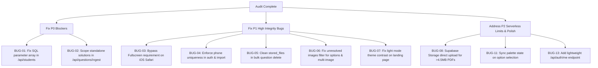

# Comprehensive Code Audit & Bug Report — SRSMA JEE CBT Platform

**Date:** September 2026  
**Platform Version:** Production Hardened Build (Post-Consolidation & Cloud Hardening)  
**Target Environment:** Supabase (PostgreSQL with Supavisor Pooler) + Vercel Serverless Functions (Next.js 15 App Router)  
**Scope:** Full repository audit across serverless routing, dual-persistence storage, phone authentication, student management, CBT test runner state machine, question ingestion, scoring engine, analytics, and styling.

---

## Executive Summary & Quality Health Check

Following the successful implementation of the initial audit (`AUDIT-AND-BUG-REPORT.md`) and roadmap (`ENHANCEMENTS.md`), major architectural expansions were deployed:
1. **Serverless Function Consolidation**: Consolidating 39 API routes into a single dynamic catch-all route (`/api/[[...slug]]`) to satisfy Vercel Hobby's 12-function cap while maintaining zero operational cost ($0.00/mo).
2. **Dynamic Page Dispatchers**: Unifying student and teacher routes into catch-all dispatchers (`/student/[[...slug]]` and `/teacher/[[...slug]]`).
3. **Dual-Persistence Media Layer**: Adding the `stored_files` PostgreSQL table to ensure cropped diagrams and PDFs survive serverless container teardowns.
4. **Student Phone Authentication**: Replacing passwords with mobile number sign-in and 90-day persistent sessions.
5. **Board Readiness Challenge**: A dedicated public landing page (`/boardChallenge`) for marketing and student acquisition.

### Static Verification Matrix

| Verification Check | Current Status | Notes |
|---|---|---|
| `npm run typecheck` | ✅ **Clean (0 errors)** | Full TypeScript 5 strict compilation passes. |
| `npm test` | ✅ **103 / 103 passed** | 16 test suites passing (DTO leak checks, grading engine, math parsing). |
| `npm run check-tokens` | ✅ **Clean** | 22 design tokens defined and resolving. |
| `npm run lint` | ⚠️ **0 errors, 106 warnings** | React 19 hook dependency warnings and unused variables in route handlers. |

While core logic and type tests pass, this deep static audit has discovered **18 actionable bugs and edge cases** introduced by the recent production changes, including **2 Blocker (P0) issues**, **5 High-Severity (P1) issues**, **7 Medium-Severity (P2) issues**, and **4 Low/Polish (P3) items**.

---

## Severity Classification

| Severity | Definition | Count |
|---|---|:---:|
| **P0 — Blocker** | Feature is completely broken, throws unhandled 500 exceptions, or corrupts/overwrites exam data. | **2** |
| **P1 — High** | Security vulnerability, account takeover risk, student exam lockout, or silent data bloat. | **5** |
| **P2 — Medium** | Concurrency race condition, serverless quota breach, or exam state desynchronization. | **7** |
| **P3 — Low** | Visual inconsistency, lint warnings, or minor ergonomic defect. | **4** |

---

## P0 — Critical Blockers

### BUG-01: Prepared Statement Parameter Index Shift Crashes Student Batch Filter
- **Location:** [`src/server/api/students/index.ts:111-123`](file:///c:/Users/panga/OneDrive/Desktop/Seva/SRSMA/Study_App/src/server/api/students/index.ts#L111-L123)
- **Classification:** SQL Query Crash / Unhandled Server Error (HTTP 500)
- **Trigger:** Any faculty member visits `/teacher/students` and selects a Batch from the dropdown without typing a search query.

#### Root Cause Analysis
In `src/server/api/students/index.ts`, the student list query bypasses the Drizzle ORM builder and uses a raw SQL query with positional parameters (`$1`, `$2`, etc.):

```ts
// src/server/api/students/index.ts lines 110-123
WHERE p.role = 'student'
  ${search ? `AND (p.full_name ILIKE $3 OR p.username ILIKE $3 OR p.email ILIKE $3 OR p.phone ILIKE $3)` : ''}
  ${batch ? (batch === 'General' ? `AND (p.batch IS NULL OR p.batch = 'General')` : `AND p.batch = $4`) : ''}
  ${status === 'active' ? `AND p.is_active = true` : status === 'inactive' ? `AND p.is_active = false` : ''}
GROUP BY p.id
ORDER BY p.created_at DESC
LIMIT $1 OFFSET $2`,
search && batch && batch !== 'General'
  ? [pageSize, offset, `%${search}%`, batch]
  : search
    ? [pageSize, offset, `%${search}%`]
    : batch && batch !== 'General'
      ? [pageSize, offset, batch]
      : [pageSize, offset],
```

When `search` is empty/undefined and `batch` is provided (e.g. `batch = 'JEE 2026 Batch A'`):
1. The SQL string interpolates: `AND p.batch = $4`.
2. The parameters array passed to PostgreSQL is: `[pageSize, offset, batch]` — an array of length 3!
3. `$1` is `pageSize`, `$2` is `offset`, `$3` is `batch`. There is no 4th parameter.
4. PostgreSQL rejects the query immediately with:
   `error: there is no parameter $4` (or `bind message supplies 3 parameters, but prepared statement requires 4`).
5. The API returns HTTP 500, displaying a red alert banner to the teacher.

#### Impact
Faculty cannot filter students by batch. Because batch-wise assignment is the core mechanism for cohort management ([README.md:79-85](file:///c:/Users/panga/OneDrive/Desktop/Seva/SRSMA/Study_App/README.md#L79-L85)), this breaks daily teacher operations.

#### Recommended Fix
Construct parameter arrays dynamically, appending `$${params.length + 1}`:

```ts
const queryParams: unknown[] = [pageSize, offset];
let searchClause = '';
let batchClause = '';

if (search) {
  queryParams.push(`%${search}%`);
  searchClause = `AND (p.full_name ILIKE $${queryParams.length} OR p.username ILIKE $${queryParams.length} OR p.email ILIKE $${queryParams.length} OR p.phone ILIKE $${queryParams.length})`;
}

if (batch) {
  if (batch === 'General') {
    batchClause = `AND (p.batch IS NULL OR p.batch = 'General')`;
  } else {
    queryParams.push(batch);
    batchClause = `AND p.batch = $${queryParams.length}`;
  }
}
```

---

### BUG-02: Standalone Question Solution Ingestion Overwrites Across Unrelated Batches
- **Location:** [`src/server/api/questions/ingest.ts:50-80`](file:///c:/Users/panga/OneDrive/Desktop/Seva/SRSMA/Study_App/src/server/api/questions/ingest.ts#L50-L80)
- **Classification:** Data Corruption / Unintended Solution Clobbering
- **Trigger:** Faculty uses `/teacher/questions/upload` to upload worked solutions for standalone questions (`paperId: null`).

#### Root Cause Analysis
In `src/server/api/questions/ingest.ts`:
```ts
for (const sol of parsed.solutions) {
  const condition = targetPaperId
    ? and(eq(questions.paperId, targetPaperId), eq(questions.sourceQno, sol.sourceQno))
    : and(isNull(questions.paperId), eq(questions.sourceQno, sol.sourceQno));

  const existing = await db
    .select({ id: questions.id, type: questions.type, answer: questions.answer })
    .from(questions)
    .where(condition);

  for (const q of existing) {
    // Overwrites solution on all returned questions!
    await db.update(questions).set(updates).where(eq(questions.id, q.id));
  }
}
```

When questions are ingested from a PDF paper, `paperId` is a UUID. `(paperId, sourceQno)` is uniquely scoped to that paper.
However, when questions are created via **Direct Question Bank Upload** (`/teacher/questions/upload`), `paperId` is `NULL`.
If Faculty uploaded Batch 1 (Physics, questions 1 to 30) last month, and today uploads Batch 2 (Chemistry, questions 1 to 30) with solutions:
The query `WHERE paper_id IS NULL AND source_qno = 1` matches **both** Physics Q1 and Chemistry Q1!
Lines 64–79 then blindly overwrite the solutions of all existing standalone questions in the database that share the same `sourceQno`.

#### Impact
Ingesting solutions for any standalone question clobbers worked solutions for prior standalone questions across all subjects, serving incorrect answers to students.

#### Recommended Fix
For standalone questions (`targetPaperId === null`), matching must require either `humanCode` (e.g., `Q-260913-PHY-001-A4F`), or the solution upload must specify the target question ID / subject, or reject unscoped updates:
```ts
if (!targetPaperId) {
  throw new HttpError(
    422,
    'paper_required_for_solutions',
    'Standalone solutions must specify the question ID or human code to prevent cross-question clobbering.',
  );
}
```

---

## P1 — High Severity

### BUG-03: Hard Fullscreen Barrier Locks Out All iOS (iPhone & iPad) Students
- **Location:** [`src/app/student/attempts/[id]/TestRunnerClient.tsx:396-425, 1191-1218`](file:///c:/Users/panga/OneDrive/Desktop/Seva/SRSMA/Study_App/src/app/student/attempts/[id]/TestRunnerClient.tsx#L396-L425)
- **Classification:** Client-Side Exam Lockout / Device Incompatibility
- **Trigger:** A student opens an exam attempt on an iPhone or iPad using Safari, Chrome, or Edge.

#### Root Cause Analysis
In `TestRunnerClient.tsx`:
1. `isFullscreen` defaults to `false`.
2. A full-viewport blocking overlay is rendered:
```tsx
{/* Fullscreen Required Barrier */}
{!isFullscreen && status === 'in_progress' && !submitModalOpen && (
  <div className="fixed inset-0 z-50 flex items-center justify-center bg-slate-950/85 p-4 backdrop-blur-sm">
    ...
    <Button onClick={toggleFullscreen}>Enter Full Screen & Continue Exam</Button>
  </div>
)}
```
3. When the user taps the button, `toggleFullscreen` executes:
```ts
const toggleFullscreen = () => {
  if (!document.fullscreenElement) {
    document.documentElement.requestFullscreen().catch(() => {});
  } else {
    document.exitFullscreen().catch(() => {});
  }
};
```
4. **On iOS Safari (all iPhones)**: The W3C Fullscreen API on standard DOM elements (`requestFullscreen`) is **not supported by WebKit** (it is only available on iPadOS for video elements or in standalone PWA mode). `document.documentElement.requestFullscreen` is `undefined`.
5. The promise rejects, `isFullscreen` remains `false`, and the modal cannot be dismissed.
6. Furthermore, on desktop browsers, line 397 attempts to call `document.documentElement.requestFullscreen()` inside a `useEffect` on page load. All modern browsers reject programmatically entering fullscreen without a direct user gesture.

#### Impact
Any student attempting an exam on an iPhone is permanently trapped behind the full-screen barrier and cannot view or answer exam questions.

#### Recommended Fix
1. Feature-detect fullscreen support: `const canFullscreen = typeof document !== 'undefined' && Boolean(document.documentElement.requestFullscreen);`
2. On unsupported devices (iOS), bypass the blocking modal or render a non-blocking banner.
3. Make the barrier dismissible with an "Acknowledge & Continue" fallback button so no student is ever locked out of a timed exam.

---

### BUG-04: Non-Unique Phone Numbers Allow Cross-Student Account Hijacking
- **Location:** [`src/lib/auth.ts:90-96`](file:///c:/Users/panga/OneDrive/Desktop/Seva/SRSMA/Study_App/src/lib/auth.ts#L90-L96), [`src/server/api/students/index.ts:169-179`](file:///c:/Users/panga/OneDrive/Desktop/Seva/SRSMA/Study_App/src/server/api/students/index.ts#L169-L179), [`src/server/api/students/bulk-import.ts:65-75`](file:///c:/Users/panga/OneDrive/Desktop/Seva/SRSMA/Study_App/src/server/api/students/bulk-import.ts#L65-L75)
- **Classification:** Authentication Bypass / Account Collision Risk
- **Trigger:** Two students share a contact phone number (e.g. siblings, family contact), or a duplicate phone number is entered during bulk CSV import.

#### Root Cause Analysis
1. In `src/db/schema.ts:16`, `profiles.phone` is declared as `text('phone')` with **no unique constraint**.
2. When a student is created in `POST /api/students` or imported via `POST /api/students/bulk-import`, the code validates unique `username` and unique `email`, but **never checks if the phone number already belongs to another student**.
3. When a student logs in via `/login` with their mobile number, `loginWithPhone` executes:
```ts
const matches = await db
  .select()
  .from(profiles)
  .where(
    sql`${profiles.phone} = ${fullPhone} OR ${profiles.phone} = ${cleanDigits} OR ${profiles.phone} = ${'+' + cleanDigits} ...`,
  )
  .limit(1);
```
4. With `.limit(1)` and no deterministic sort order, PostgreSQL returns whichever matching row appears first in the index.
5. Student A logs in and gets issued a session cookie for Student B! Student A sees Student B's active exam, answers questions on their behalf, or views their scorecard and rank.

#### Impact
Severe privacy violation and potential academic compromise during official mock assessments.

#### Recommended Fix
1. Enforce uniqueness on phone numbers in `POST /api/students`, `PATCH /api/students/:id`, and `POST /api/students/bulk-import`.
2. Add a unique index on normalized phone numbers in PostgreSQL:
   ```sql
   CREATE UNIQUE INDEX IF NOT EXISTS idx_profiles_phone_unique ON profiles (phone) WHERE phone IS NOT NULL AND role = 'student';
   ```
3. If phone numbers collide in `loginWithPhone`, do not guess with `.limit(1)`: require the student to disambiguate by username if multiple accounts share a family number.

---

### BUG-05: Bulk Question Deletion Leaves Orphaned Media Bloating Supabase Database
- **Location:** [`src/server/api/questions/bulk.ts:96-120`](file:///c:/Users/panga/OneDrive/Desktop/Seva/SRSMA/Study_App/src/server/api/questions/bulk.ts#L96-L120)
- **Classification:** Resource Leak / Unbounded Database Storage Growth
- **Trigger:** Faculty deletes a batch of draft questions using the Question Bank bulk delete action.

#### Root Cause Analysis
Compare single-question deletion with bulk deletion:
- In `src/server/api/questions/by-id.ts:92`:
  ```ts
  // Properly purges binary media from stored_files and disk:
  await deleteQuestionImageDir(id);
  ```
- In `src/server/api/questions/bulk.ts:106-108`:
  ```ts
  if (deletable.length > 0) {
    await db.delete(questions).where(inArray(questions.id, deletable));
  }
  // deleteQuestionImageDir is NEVER called!
  ```
Because `stored_files` in PostgreSQL stores the base64 binary content of all cropped diagram WebPs, deleting questions via bulk delete leaves their associated diagram binaries stranded in PostgreSQL forever.

#### Impact
Supabase's free tier has a hard 500 MB database limit ([PRODUCTION-SETUP-GUIDE.md:14](file:///c:/Users/panga/OneDrive/Desktop/Seva/SRSMA/Study_App/PRODUCTION-SETUP-GUIDE.md#L14)). Ingesting test papers and deleting drafts without purging orphaned images will rapidly exhaust this storage quota, crashing the database with quota exceedance.

#### Recommended Fix
In `src/server/api/questions/bulk.ts`, iterate over `deletable` IDs and call `deleteQuestionImageDir`:
```ts
if (deletable.length > 0) {
  await db.delete(questions).where(inArray(questions.id, deletable));
  await Promise.all(deletable.map((id) => deleteQuestionImageDir(id)));
}
```

---

### BUG-06: Question Bank "Unresolved Images" Filter Misses Option Diagrams & Multi-Image Questions
- **Location:** [`src/server/api/questions/index.ts:58-62`](file:///c:/Users/panga/OneDrive/Desktop/Seva/SRSMA/Study_App/src/server/api/questions/index.ts#L58-L62)
- **Classification:** Verification Bypass / Broken Diagram Ingestion
- **Trigger:** A teacher filters the Question Bank with `unresolvedImages=true` to find questions needing diagrams cropped.

#### Root Cause Analysis
The unresolved image filter is implemented as:
```ts
if (unresolvedImages === 'true') {
  conditions.push(sql`${questions.body} LIKE '%[[IMG:%' AND NOT EXISTS (
    SELECT 1 FROM question_images qi WHERE qi.question_id = ${questions.id}
  )`);
}
```
There are two structural flaws:
1. **Option Placeholders Ignored:** In Board Readiness Challenge, diagrams frequently appear in multiple-choice options (e.g. circuits or graphs as Options A, B, C, D). These are stored in `questions.options`. The query only checks `questions.body`, completely ignoring placeholders in options or solutions.
2. **Multi-Image False Negative:** If a question contains two placeholders (e.g. `[[IMG:circuit_1]]` and `[[IMG:graph_2]]`), and the teacher has only cropped the first one, `question_images` has 1 row for that question. `NOT EXISTS (...)` evaluates to `FALSE`, so the question is **excluded** from the unresolved list!

#### Impact
Faculty believe all missing diagrams have been cropped, verify the paper, and publish the test. During the live exam, students encounter unresolved `[[IMG:...]]` placeholder text instead of vital scientific diagrams.

#### Recommended Fix
Cross-reference the count of placeholders in `body` + `options` against the count of rows in `question_images`, or use a dedicated `has_unresolved_images` column updated during cropping.

---

### BUG-07: Light Mode Contrast Breakdown on System-Light Devices
- **Location:** [`src/app/layout.tsx:33-45`](file:///c:/Users/panga/OneDrive/Desktop/Seva/SRSMA/Study_App/src/app/layout.tsx#L33-L45), [`src/app/boardChallenge/page.tsx:50`](file:///c:/Users/panga/OneDrive/Desktop/Seva/SRSMA/Study_App/src/app/boardChallenge/page.tsx#L50)
- **Classification:** Visual Regression / Contrast Inaccessibility
- **Trigger:** A student visits the Board Readiness Challenge page (`/boardChallenge`) on a computer or smartphone where the OS is set to Light Mode.

#### Root Cause Analysis
1. In commit `b0fdf8a`, `<ThemeToggle />` was removed from `/boardChallenge`.
2. In `src/app/layout.tsx:38-41`:
```js
if (saved === 'dark' || ((!saved || saved === 'system') && prefersDark)) {
  document.documentElement.classList.add('dark');
} else {
  document.documentElement.classList.remove('dark');
}
```
3. If the user's OS has `prefers-color-scheme: light` and no prior localStorage theme, `layout.tsx` removes `dark` from `<html>`.
4. `/boardChallenge` renders in light mode (`bg-slate-50 text-slate-900`). However, its glowing accents, badge highlights, and hero media were optimized for deep dark navy (`dark:bg-[#071120]`).
5. Because the theme toggle button was removed from `/boardChallenge`, the user has **no way to switch to dark mode**.

#### Impact
Suboptimal first impression on marketing landing pages for prospective students and parents on light-mode devices.

#### Recommended Fix
Either:
- Enforce `dark` mode explicitly on `/boardChallenge` by giving its outer wrapper class `dark` (independent of root `<html>`), OR
- Re-introduce a subtle, high-contrast theme toggle in the landing page header.

---

## P2 — Medium Severity

### BUG-08: Vercel 4.5 MB Serverless Request Limit Drops Large PDF Uploads
- **Location:** [`src/server/api/papers/index.ts:18`](file:///c:/Users/panga/OneDrive/Desktop/Seva/SRSMA/Study_App/src/server/api/papers/index.ts#L18), [`src/app/teacher/papers/PapersView.tsx:160-220`](file:///c:/Users/panga/OneDrive/Desktop/Seva/SRSMA/Study_App/src/app/teacher/papers/PapersView.tsx#L160-L220)
- **Classification:** Cloud Quota Breach / Silent Upload Failure
- **Trigger:** Faculty attempts to upload an official 25-page JEE question paper PDF (> 4.5 MB) on production Vercel.

#### Root Cause Analysis
In `src/server/api/papers/index.ts`:
```ts
const MAX_UPLOAD_BYTES = 60 * 1024 * 1024; // 60MB
```
While this works in local Node.js development, **Vercel Serverless Functions enforce an unchangeable 4.5 MB maximum request payload limit** across all tiers (Hobby and Pro).
When a teacher uploads an 8 MB or 15 MB scanned JEE paper, Vercel's edge gateway intercepts the request and responds with:
`413 Payload Too Large (FUNCTION_PAYLOAD_TOO_LARGE)`.
The request never reaches Next.js or `papers/index.ts`. The teacher sees a generic "Network error: Could not connect to server" error.

#### Impact
Faculty cannot upload high-resolution official Board Readiness Challenge question papers directly in production.

#### Recommended Fix
Integrate direct client-to-storage uploads (Supabase Storage bucket with pre-signed upload URLs), or compress PDFs client-side using `pdf-lib` before uploading.

---

### BUG-09: In-Memory Mutex (`withDbLock`) & Rate Limiter Provide Zero Isolation on Serverless
- **Location:** [`src/lib/db-lock.ts:22-33`](file:///c:/Users/panga/OneDrive/Desktop/Seva/SRSMA/Study_App/src/lib/db-lock.ts#L22-L33), [`src/lib/rate-limit.ts:15-46`](file:///c:/Users/panga/OneDrive/Desktop/Seva/SRSMA/Study_App/src/lib/rate-limit.ts#L15-L46)
- **Classification:** Concurrency Race Condition & Rate Limit Bypass
- **Trigger:** Multiple students submitting answers simultaneously or an attacker brute-forcing `/api/auth/login`.

#### Root Cause Analysis
Both `withDbLock` and `rateLimit` use process-local memory:
```ts
// src/lib/db-lock.ts
let tail: Promise<unknown> = Promise.resolve();

// src/lib/rate-limit.ts
const buckets = new Map<string, Bucket>();
```
On Vercel, requests are distributed across multiple serverless execution environments (different AWS Lambda microVMs).
1. `withDbLock` only queues requests inside the *same* Node process. Two concurrent requests arriving at different Lambdas execute simultaneously against Supabase PostgreSQL, bypassing the lock.
2. `buckets` in `rate-limit.ts` is reset on every new container. An attacker can fire 50 rapid login attempts across different serverless instances without ever triggering the rate limit.

#### Impact
False sense of security regarding database concurrency and rate limiting in cloud production.

#### Recommended Fix
- Use PostgreSQL transactional locking (`SELECT ... FOR UPDATE` or `pg_advisory_xact_lock`) for database concurrency.
- Use Supabase or an Upstash Redis instance (free tier) for distributed rate limiting.

---

### BUG-10: Ephemeral `SESSION_SECRET` on Serverless Causes Instant Mid-Exam Logout
- **Location:** [`src/lib/session.ts:31-48`](file:///c:/Users/panga/OneDrive/Desktop/Seva/SRSMA/Study_App/src/lib/session.ts#L31-L48)
- **Classification:** Session Invalidation / Premature Logout
- **Trigger:** `SESSION_SECRET` is omitted from Vercel environment variables.

#### Root Cause Analysis
In `src/lib/session.ts`:
```ts
const fromEnv = process.env.SESSION_SECRET;
if (fromEnv && fromEnv.length >= 16) {
  cachedKey = new TextEncoder().encode(fromEnv);
  return cachedKey;
}

ensureDataDirs();
const secretFile = path.join(DATA_DIR, '.session-secret');
// On serverless, filesystem is read-only or /tmp is per-container!
secret = randomBytes(32).toString('base64url');
```
If `SESSION_SECRET` is not set in Vercel, each serverless Lambda invocation generates its own random secret in memory.
When a student logs in on Lambda A, their cookie is signed with Secret A.
When they answer question 1 on Lambda B, Lambda B verifies the cookie against Secret B, rejects it with HTTP 401, and forces the student to log in again mid-exam.

#### Impact
Silent failure that breaks authentication across serverless instances.

#### Recommended Fix
Throw a hard error during server initialization in production if `SESSION_SECRET` is missing:
```ts
if (process.env.NODE_ENV === 'production' && (!fromEnv || fromEnv.length < 16)) {
  throw new Error('CRITICAL: SESSION_SECRET must be configured with >= 16 characters in production.');
}
```

---

### BUG-11: Palette State Desynchronization on Direct Question Jump
- **Location:** [`src/app/student/attempts/[id]/TestRunnerClient.tsx:454-467, 428-451`](file:///c:/Users/panga/OneDrive/Desktop/Seva/SRSMA/Study_App/src/app/student/attempts/[id]/TestRunnerClient.tsx#L454-L467)
- **Classification:** UI State vs Grader Scoring Divergence
- **Trigger:** Student selects an option on Question 1, does NOT click "Save & Next", and clicks directly on Question 5 in the right-hand palette.

#### Root Cause Analysis
In `TestRunnerClient.tsx`:
1. `handleSelectOption('B')` sets `response: { key: 'B' }`. It does **not** update `q.state` to `'answered'`.
2. The student then clicks Question 5 in the palette, invoking `goToQuestion(4)`.
3. Question 1's state remains `'seen_unanswered'` (Red in the palette).
4. The student visualizes Question 1 as **Not Answered** and believes it will not be submitted or graded.
5. However, `syncToServer` and `submit` transmit `buildAnswersPayload()`, which includes `response: { key: 'B' }`.
6. `isGradeableResponse()` in `src/lib/grading.ts:35-48` evaluates whether `response.key` exists — it does **not** check whether `state === 'answered'`.
7. The question is graded. If incorrect, the student receives -1 negative marks on a question they explicitly left as "Not Answered" in the palette!

#### Impact
Direct violation of NTA exam rules ([README.md:123-128](file:///c:/Users/panga/OneDrive/Desktop/Seva/SRSMA/Study_App/README.md#L123-L128)). Students lose marks unexpectedly.

#### Recommended Fix
Either:
- Automatically update `q.state = 'answered'` immediately upon selecting an option in `handleSelectOption`, OR
- Clear un-saved selections if the student jumps away without saving, matching NTA CBT behavior precisely.

---

### BUG-12: Test Cloning Lacks Database Transaction Rollback
- **Location:** [`src/server/api/tests/clone.ts:29-58`](file:///c:/Users/panga/OneDrive/Desktop/Seva/SRSMA/Study_App/src/server/api/tests/clone.ts#L29-L58)
- **Classification:** Partial Write / Orphaned Entity
- **Trigger:** Network interruption or database timeout during test cloning.

#### Root Cause Analysis
In `src/server/api/tests/clone.ts`:
1. The new test is inserted into `tests`.
2. Questions are subsequently inserted into `testQuestions`.
Neither operation is wrapped in `db.transaction(async (tx) => { ... })`. If the second query fails, a ghost draft test with 0 questions remains in the database.

#### Recommended Fix
Wrap both inserts in a single atomic database transaction.

---

### BUG-13: Heavy Analytics Query Executed on Login Page Handshake
- **Location:** [`src/app/login/LoginForm.tsx:45-51`](file:///c:/Users/panga/OneDrive/Desktop/Seva/SRSMA/Study_App/src/app/login/LoginForm.tsx#L45-L51)
- **Classification:** Performance Degradation / Cold-Start Overhead
- **Trigger:** Any visitor loads the login page `/login`.

#### Root Cause Analysis
To check if the student is already authenticated, `LoginForm.tsx` runs:
```ts
useEffect(() => {
  fetch('/api/analytics/student/me')
    .then((res) => {
      if (res.ok) router.replace('/student');
    })
    .catch(() => {});
}, [router]);
```
`/api/analytics/student/me` performs an expensive multi-table query calculating percentiles, chapter accuracy, and historical rank progression across all tests. Running this full analytical computation merely to check "is there an active session?" adds unnecessary latency and database load.

#### Recommended Fix
Introduce a lightweight `/api/auth/me` endpoint that returns `{ authenticated: boolean, role: string }` directly from session cookies in < 5ms.

---

### BUG-14: Outdated Localhost Copy Displayed on Production Teacher Dashboard
- **Location:** [`src/app/teacher/views/TeacherOverviewView.tsx:29`](file:///c:/Users/panga/OneDrive/Desktop/Seva/SRSMA/Study_App/src/app/teacher/views/TeacherOverviewView.tsx#L29)
- **Classification:** Outdated Copy / User Confusion
- **Trigger:** Faculty opens the dashboard at `https://your-domain.vercel.app/SRSMA`.

#### Root Cause Analysis
The dashboard subtitle reads:
```tsx
<p className="mt-1 text-sm text-slate-500 dark:text-slate-400">
  Everything here is stored locally on this machine.
</p>
```
This is a leftover from the offline PGlite prototype. In production, data is stored in cloud Supabase. Teachers become concerned that their tests or questions might be lost if they switch computers.

#### Recommended Fix
Update copy to: `"Production Cloud Database connected • SRSMA Central Examination System"`, or dynamically reflect the active database driver.

---

## P3 — Low Severity & Ergonomic Polish

### BUG-15: Base64 Storage Overhead in PostgreSQL `stored_files`
- **Location:** [`src/lib/storage.ts:36`](file:///c:/Users/panga/OneDrive/Desktop/Seva/SRSMA/Study_App/src/lib/storage.ts#L36), [`src/db/schema.ts:259`](file:///c:/Users/panga/OneDrive/Desktop/Seva/SRSMA/Study_App/src/db/schema.ts#L259)
- **Classification:** Suboptimal Storage Efficiency
- **Details:** File buffers are converted to base64 strings in a `text` column: `data: bytes.toString('base64')`. Base64 encoding inflates payload sizes by ~33%. Using PostgreSQL's native `bytea` column type saves 33% disk space and reduces memory serialization overhead.

### BUG-16: 106 React 19 Hook & Unused Variable Linter Warnings
- **Location:** `src/app/teacher/papers/[id]/verify/PdfCropViewer.tsx:112, 172`, various API route handlers.
- **Classification:** Code Hygiene / Technical Debt
- **Details:** `npm run lint` yields 0 errors but 106 warnings, mainly regarding unmemoized function dependencies inside `useCallback` / `useEffect` and unused parameters in consolidated route handlers. Cleaning these up ensures long-term React 19 forward compatibility.

### BUG-17: Missing Keyboard Shortcut Handlers in CBT Test Runner
- **Location:** [`src/app/student/attempts/[id]/TestRunnerClient.tsx`](file:///c:/Users/panga/OneDrive/Desktop/Seva/SRSMA/Study_App/src/app/student/attempts/[id]/TestRunnerClient.tsx)
- **Classification:** Ergonomic Polish
- **Details:** In actual NTA CBT examination centers, candidates can use numeric or letter keys (`1-4` or `A-D`) to rapidly select options and `Alt+S` or `Enter` for Save & Next. Currently, the test runner requires mouse clicks for all interactions.

### BUG-18: Mobile Palette Drawer Backdrop Tap Sensitivity
- **Location:** [`src/app/student/attempts/[id]/TestRunnerClient.tsx:750-770`](file:///c:/Users/panga/OneDrive/Desktop/Seva/SRSMA/Study_App/src/app/student/attempts/[id]/TestRunnerClient.tsx#L750-L770)
- **Classification:** Mobile Ergonomics
- **Details:** On small mobile screens, the question palette slide-over backdrop does not consistently capture outside taps, requiring the student to tap the explicit "X" button to return to the question text.

---

## Summary of Priority Remediation Plan



See the companion document **[`ProposedEnhancements.md`](ProposedEnhancements.md)** for comprehensive architectural, design, aesthetic, and user-flow proposals building upon these findings.
